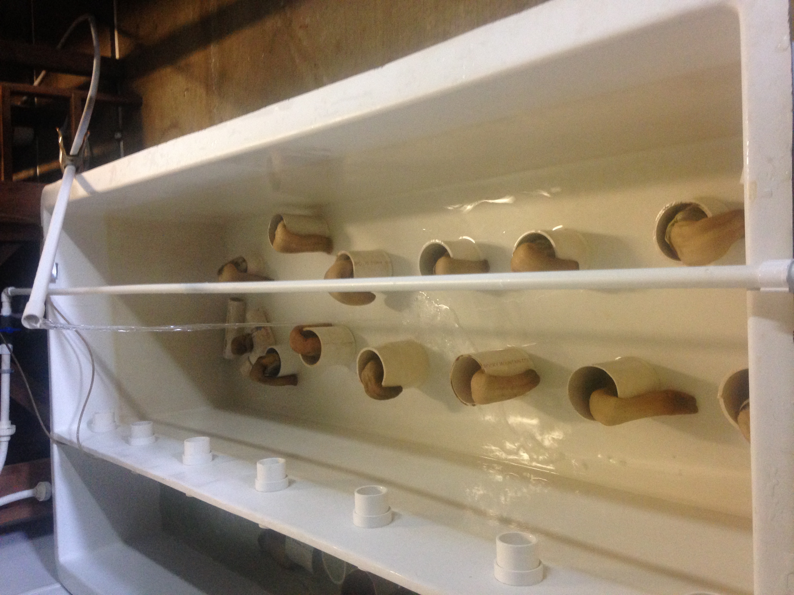
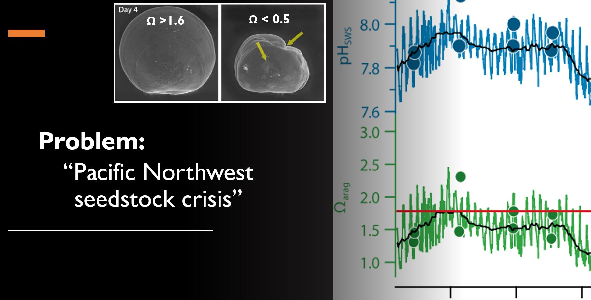
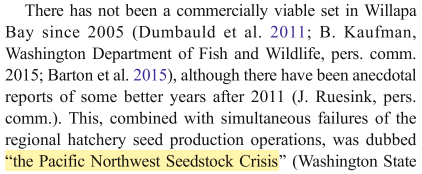
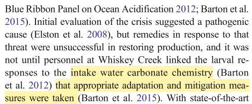
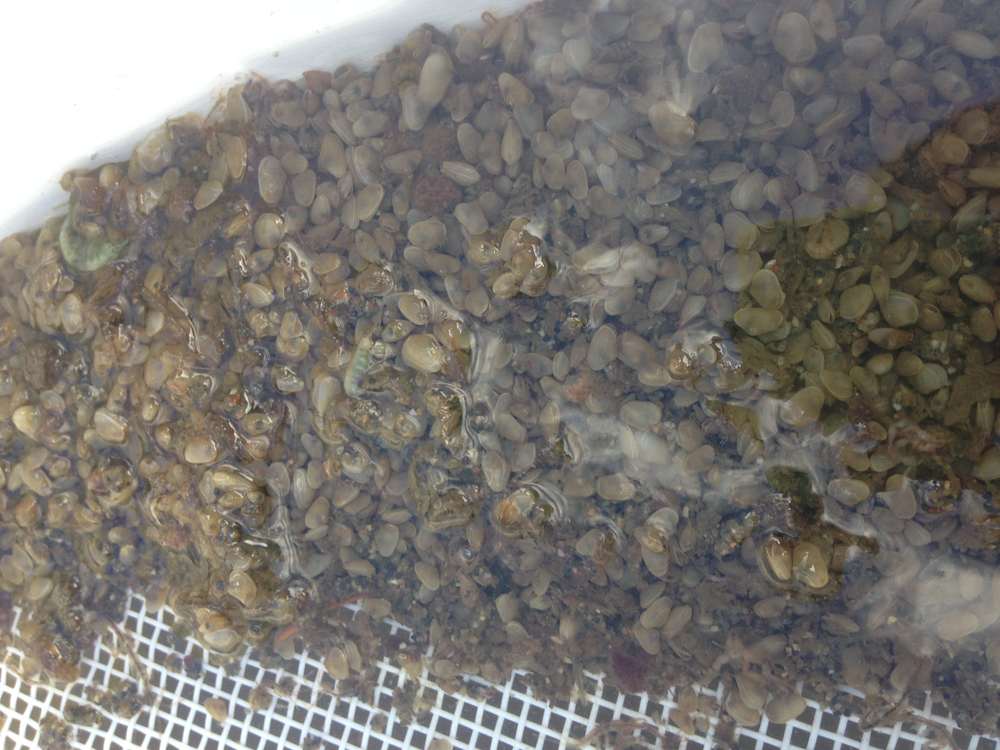
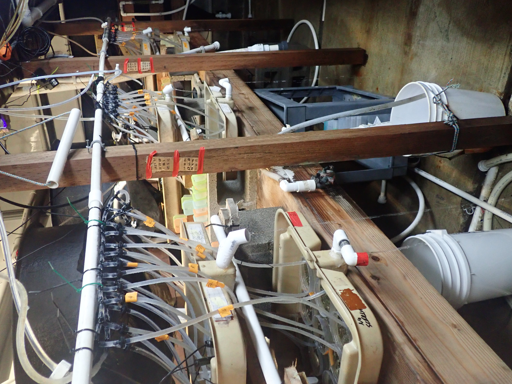
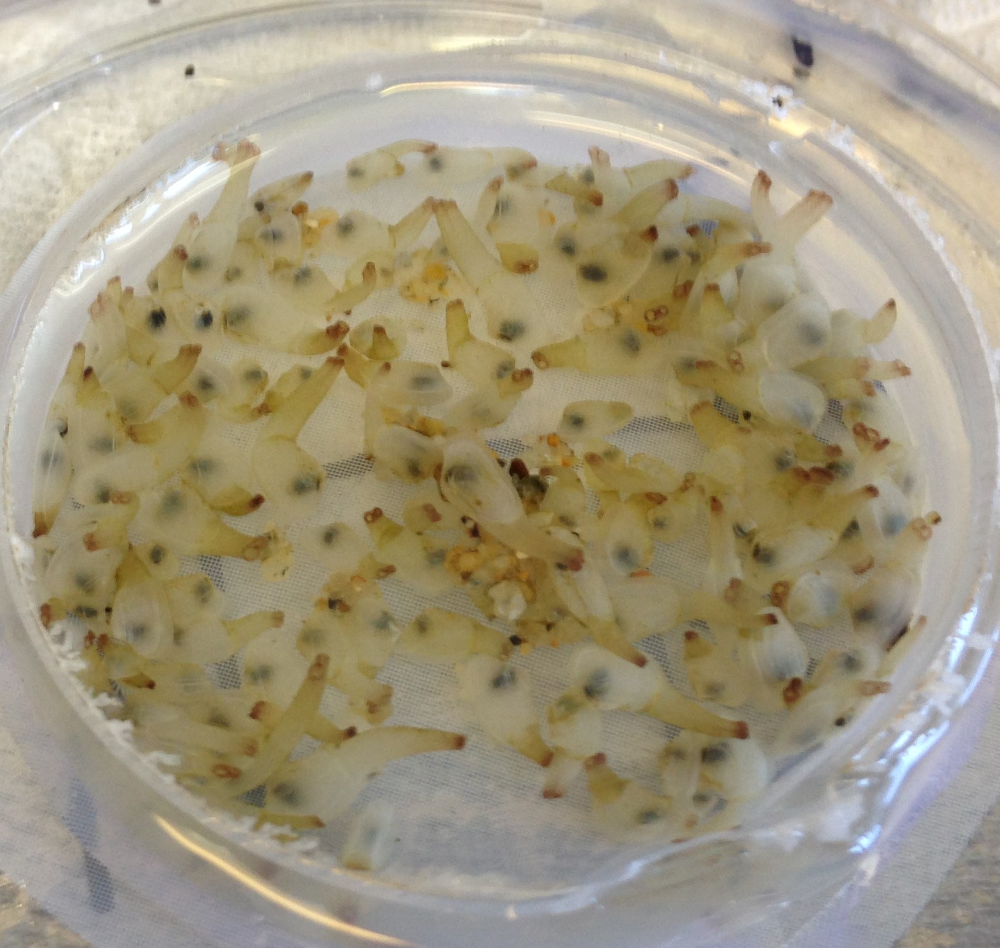

  <!-- MDTOC maxdepth:6 firsth1:0 numbering:1 flatten:0 bullets:1 updateOnSave:0 -->
# **Pacific Geoduck Aquaculture Handbook**

## **Table of Contents**
  - 1. [About](#About)
      - 1.1. [Purpose of this handbook](#Why-Read-this-Handbook?)
      - 1.2. [Background](#Pacific-geoduck-Panogea-generosa)
  - 2. [General Practices](#I-General-Rearing-Practices)
      - 2.1. [Hatchery Overview](#I1-The-hatchery)
      - 2.2. [Broodstock Conditioning & Natural Spawning](#I2-Broodstock-Conditioning--Natural-Spawning)
      - 2.3. [Larvae and Seed](#I.3-Larvae-and-Seed)
  - 3. [Strip Spawning](#II-Strip-spawning)
      - 3.1. [General Procedure](#II1-General-Procedures)
      - 3.2. [Takeaways for Aquaculture](#II2-Takeaways-for-Aquaculture)
  - 4. [Climate Change & Aquaculture](#III-Climate-Change--Aquaculture)
      - 4.1 [Ocean Acidification](#III1-Ocean-Acidification)
      - 4.2 [Stress Priming](#III2-Future-Solution-Stress-Priming)
        - 4.2.1 [Broodstock](#Broodstock)
        - 4.2.1 [Larvae and Juveniles](#Larvae-and-Juveniles)
      - 4.3 [Summary of Our Findings](#III3-Initial-Tests--Results)
      - 4.4 [Takeaways for Aquaculture](#IV4-Takeaways-for-Aquaculture)
  - 5. [Acknowledgements](#Acknowledgements)

# **About**
  > *A BREIF STATEMENT*

Shellfish aquaculture is essential to prevent overexploitation of wild stock, ensure food security, and meet demands of increasing global trade.

## **Why Read this Handbook?**

This handbook is the result of collaborative research between Jamestown S'klallam Point Whitney Shellfish Hatchery and researchers from Univeristy of Washington and University of Rhode Island.

  >  ***INSIDE....***
  >   * *GENERAL INFORMATION*
      - *breif overview of standard hatchery practice for Pacific geoduck*
  >   * *TOOLS FOR HATCHERY ENHANCEMENT*
      - *strip spawning*
      - *identification of sex and reproductive status*
  >   * *COMBATING CLIMATE CHANGE!*
      - *Can '"stress priming" increase tolerance under Ocean Acidification?*
  >   * *photos, tables, and figures!*

## **Pacific geoduck *Panogea generosa***

Long-lived infaunal clam (records up to 168 years-of-age) of commercial and ecological importance with a native range from Alaska to Baja, California.

**Importance of Pacific geoduck production**
  - **Cultural**
  - **Ecological**
  - **Economic value**
    - Total revenue of >$24 million yearly (in Washington State)
    - ~27% of the overall shellfish revenue (in Washington State)
#### Value of Pacific geoduck

Life-stage | Age  | Price  | Purpose
--------   | -----| ----  | ---
Seed   | 5-7 months | $0.15-0.30 each | growers
Adult  |  4-6 years | >$14 per pound | consumption & broodstock

  > *DID YOU KNOW?*
  - *As of 2015, Washington State (USA) alone provided nearly 90% of sustainably-produced Pacific geoduck world-wide!*

# **I. General Rearing Practices**

## **I.1. The hatchery**
The success of shellfish industry is fueled by the hatchery. Here, technicians work around to clock to ensure optimal conditions for growth and survival. Below is a cartoon overview of geoduck aquaculture. The hatchery is the site of broodstock reproduction and subseqent husbandry from embryo to juvenile stage.

## **Geouck aquaculture requires  the following facilities**
### **Algae, algae... and more algae**
  - **Greenhouse(s) and algae room(s)**: live algae feed is pivotal in hatchery maintanance and production success. Daily, technicians clean, culture, and feed-out both large-low and small-dense batch cultures. Typical algae concentrations (cells per milliliter, c-1 ml-1) of the batch cultures range from 50,000 c-1 ml-1 (large-low density) to 1-2 milllion c-1 ml-1 (small-high density). A few important species common to Pacific geoduck aquaculture are *Isocrysis*, *Pavlova*, *Tetraselmis*, and *Chaetoceros*. Feed composition and species density is life-stage dependent for optimal geoduck growth and survivial.

#### **Table: Feed and geoduck life stages**

  Life-stage | Age  | Density (c-1 ml-1)  | Composition (algae species)
--------   | -----| ----  | ---
Fetilized eggs / embryo   | 0-0.5 days | NA | NA
Trochophore  |  < 1-2 days | NA | NA
D-hinge & Umbone 'mature' larvae / Prodissoconch I & II  | 2-16 days | 10,000-50,000 (stepwise over time) | small cells; i.e. *Isocrysis*, *Chaetoceros*, *Pavlova*
Pediveliger / Dissoconch   | 16 - 35 days | 50,000 | small cells; i.e. *Isocrysis*, *Chaetoceros*, *Pavlova*
Juvenile  |  36 days - 5 to 7 months (preceeding grow-out) | 50,000 | mixed diet (incliude *Tetraselmis*)
Broodstock (spawning)  |  4-6 years | 50,000-200,0000 | mixed; *Isocrysis* preferred to elicit spawning

> *NOTE: Timing of growth and development during early-life stages is largely temperature dependent*
  - Goodwin, C. L., & Pease, B. (1989). Species Profiles. Life Histories and Environmental Requirements of Coastal Fishes and Invertebrates (Pacific Northwest). Pacific Geoduck Clam. Washington State Dept of Fisheries Brinnon Point Whitney Shellfish Lab.
  - Goodwin, C. L. (1973). Effects of salinity and temperature on embryos of the geoduck clam (Panope generosa Gould). In Proceedings of the National Shellfisheries Association (Vol. 63, pp. 93-95).
#### *Spawning*
  - **Broodstock tanks**:

#### *Early-life husbandry*
  - **Larval rearing tanks**:
  - **Larvae conical tanks**:

#### *Seed production*
  - **Setting tables**:
  - **Upwelling and downwelling tanks**:

   Reproduction and early development of shellfish are pivotal life stages
The success of a producer is largely dependent on limitations within the hatchery
and experience of its personnel.

 Mat Henderson, hatchery manager at Jamestown Point Whitney Shellfish HAtchery, rinsing a 20µm seive with million of D-hinge geoduck larvae.

  

## **I.2. Broodstock Conditioning & Natural Spawning**
Broodstock are adult animals either grown or collected for spawning in hatcheries.

  

> *FOOD FOR THOUGHT:*
  * ***How adult diet & envrionment affects offspring***
    - Utting, S. D., & Millican, P. F. (1997). Techniques for the hatchery conditioning of bivalve broodstocks and the subsequent effect on egg quality and larval viability. Aquaculture, 155(1-4), 45-54.
    - Parker, L. M., Ross, P. M., O'Connor, W. A., Borysko, L., Raftos, D. A., & Pörtner, H. O. (2012). Adult exposure influences offspring response to ocean acidification in oysters. Global change biology, 18(1), 82-92.
    - Parker, L. M., O’Connor, W. A., Raftos, D. A., Pörtner, H. O., & Ross, P. M. (2015). Persistence of positive carryover effects in the oyster, Saccostrea glomerata, following transgenerational exposure to ocean acidification. PLoS One, 10(7).
    - Parker, L. M., O'Connor, W. A., Byrne, M., Coleman, R. A., Virtue, P., Dove, M., ... & Ross, P. M. (2017). Adult exposure to ocean acidification is maladaptive for larvae of the Sydney rock oyster Saccostrea glomerata in the presence of multiple stressors. Biology letters, 13(2), 20160798.

## **I.3 Larvae and Seed**

about here!

# **II. Strip spawning**
A major artifact of geoduck aquaculture is the **spontaneous and opportunistic nature of natural spawning events**. For example, an unplanned nighttime natural spawn of a female geoduck set the stage for the growing season at Jamestown Point Whitney Shellfish Hatchery in winter 2019 (*Mat Henderson, personal communication*). Millions of eggs (~30) were released into a single broodstock tank with two dozen other animals (of unknown sex) and under seawater flow-though. In an optimal scenario, technicians would have isolated the spawning female to a static tank to control spawning/fertilization and maximize  egg yield. This event lead to a totally autotomous fertilization process outside of standard 9:00am - 5:00pm work hours. In most cases, spontaneous and unplanned spawning presents major loss in potential profit - luckily, personnel at JPWSH live on site and were able to salvage fertilized embryos.

Losses in production and profit are unfortunately common in shellfish aquaculture. In the story stated above, aquaculture technicians were limited by two main factors:
- **sex identification of broodstock**: The sex is unknown to hatchery personnel and is only revelead once an individual begins spawning.
- **reproductive status of broodstock**: Wild broodstock are typically collected in early winter and are fed algae-rich diets at the hatchery for several weeks/months to assume an optimal reproductive state. However, the timing to start controlled spawning attempts remains poorly understood.

#### We deployed new techniques to track adult geoduck

Trait  | Importance in Aquaculture | Technique | Note
------------- | ------------- | ---------- | ----|
**Sex of broodstock groups** | avoid spontaneous spawning and fertilization; enhance control of spawning attempts | **gonad biopsy** | invasive sub-lethal
|  |   |   |
**Reproductive status** | determine optimal timining for spawning; identify individuals to focus spawning efforts; control and increase diversity| **qPCR vitellogenin**, **gonad biopsy** | minimially invasive; invasive sub-lethal

## **II.1. General Procedures**
about here!

## **II.2. Takeaways for Aquaculture**
associated costs wiith invasive/minimially invasive techniques for reprodutive status

# **III Climate Change & Aquaculture**
about here!

## **III.1. Ocean Acidification**
>  *A BOTTLENECK FOR SHELLFISH PRODUCERS*

Hatchery losses in recent years due to ocean acidification demand investigation of adaptive resilience to anthropogenic stressors

 > *THE SOLUTIONS*

## **III.2. Future Solution: Stress Priming**
> *WHAT DOES NOT KILL YOU MAKES YOU STRONGER?*

#### **What does this mean?**

### **Broodstock**

### **Larvae and Juveniles**

## **III.3 Initial Tests & Results**

Life stage  | Treatment | measurement | response
------------- | ------------- | ---------- | ----------
Broodstock  | 7.8 (ambient) v. constant 6.8 v. oscillating 6.8| survival |
            |   | fecundity / reproductive success |
gametes (egg and sperm)                | | lipid index |
larvae (D-hinge)                       | | |
larvae (pediveligers)                  | | |
juveniles (5-10 months)                | pH  = 7.8 (ambient) v. 7.2; Ω arag sat. = 1.3 v. 0.4 | survival   |   no mortality after repeated short-term exposures (6 - 10 days)
                                       | | metabolism |  initial 25% decrease, **able to recover** and cope with short-term stress; evidence of **"memory" and positive carry over** later in life |
                                       | | shell growth | initial decrease 3.6% length, but **compensatory growth** reveals benefits of early life exposure |
juveniles (3-6 months)                 | | |

## **IV.4 Takeaways for Aquaculture**

# **Acknowledgements**

We thank our funding source the Foundation for Food and Agriculture research; Grant ID: 554012, Development of Environmental Conditioning Practices to Decrease Impacts of Climate Change on Shellfish Aquaculture.

Jamestown S'klallam Tribe & Jamestown Point Whitney Shellfish Hatchery

< insert picture of Kurt and the Jamestown personnel here>

##### Plasticity:
###### a.) phenotype(s)
Broadly defined as **physical traits** expressed by an organism. These traits are reffered to as **"plastic"** becasue of they can **change in response to the envrionment.** Scientists are now engaged in **phenotypic plasticity** to study the  impact of envrionmental conditions and human disturbances  on the fitness and performance of organisms (i.e. ability to survive, grow, and reproduce)

For example, the development or growth rate of a mollusc are critical phenotypic traits and indicators of animal performance in aquaculture. Hatcheries often focus on "plastic" modifications to growth and development (phenotypes) under an array of diets and temperatures (envrionmental condition).

###### b.) Transgenerational plasticity
Transgenerational plasticity (TGP) is a phenomenon in which parental exposure to an envrionmental condition elicits phenotypic change(s) in their offspring (Kovalchuk 2012; Badyaev 2005). In recent years that has been considerable effort to investigate TGP in response to ocean acidification. **Inheritable stress resiliance** can be an important stradegy for sustainable production.

Long-lived molluscs, such as P. generosa, are incapable of rapid generational turnover on evolutionary timescales to adapt under rapid envrionmental change. TGP, as an acclimatory response, presents a single generation onset of phenotypic modificaitons relative to evolutionary timescales. Investigation of TGP in Pacific geoduck can reveal amaeorative phenotypes to cope with disturabcens such as ocean acidification.
