# Pacific Geoduck Aquaculture Handbook (*Panopea generosa*)

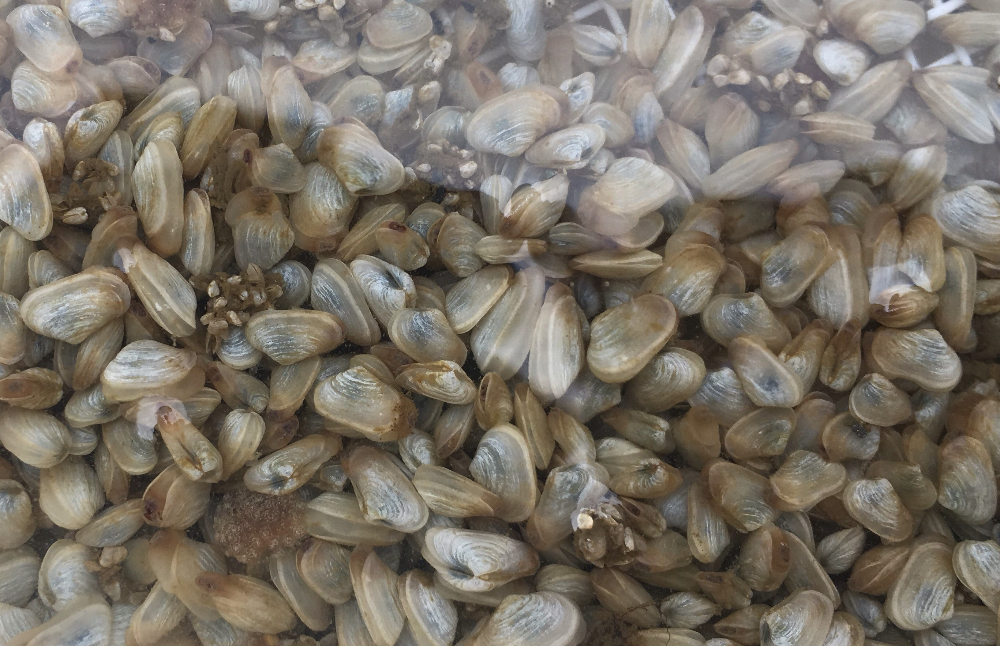

# Table of Contents

  ##  [About](#about-1)

  ##  [Purpose of this handbook](#why-read-this-handbook)

  ##  [Background](#pacific-geoduck-panogea-generosa)

  ## I. [General Rearing Practices](#i-general-rearing-practices-1)

  - ###  I.1. [Hatchery Overview](#i1-the-hatchery)

  - ###  I.2. [Broodstock Conditioning & Natural Spawning](#i2-broodstock-conditioning--natural-spawning-1)

  - ###  I.3. [Larvae and Seed](#i3-larvae-and-seed-1)

  - ###  I.4. [Grow out](#i4-grow-out-1)

  - ###  I.5. [Production enhancement](#i5-production-enhancement-1)

  ##  II. [Broodstock & Spawning Enhancement Strategies](#ii-broodstock--spawning-enhancement-strategies-1)

  - ###  II.1 [Identification of Sex & Reproductive Status](#ii1-identification-of-sex--reproductive-status-1)

    - ###  II.1.1 [Gonad Biopsy](#ii11-general-procedure-gonad-biopsy)

    - ### II.1.2 [Hemolymph Extraction](#ii12-general-procedure-hemolymph-extraction-vitellogenin)

  - ###  II.2. [Strip Spawning](#ii2-strip-spawning-1)

  - ###  II.3. [Takeaways for Aquaculture](#ii3-takeaways-for-aquaculture-1)

  ##  III. [Climate Change & Aquaculture](#iii-climate-change--aquaculture-1)

  - ###  III.1 [Ocean Acidification](#iii1-ocean-acidification-1)

  - ###  III.2 [Stress Priming](#iii2-future-solution-stress-priming)

    - ###  III.2.1.1 [Broodstock](#iii211-broodstock-1)

        ###  a. [Gonad histology of conditioned broodstock](#-a-gonad-histology-of-conditioned-broodstock)    

    - ###  III.2.1.2 [Larvae and Juveniles](#iii212-larvae-and-juveniles-1)

        ###  a. [Acute exposure and carryover effects](#-a-repeat-exposure-experiment)

        ###  b. [Stress conditioning on subsequent response](#-b-stress-conditioning-on-subsequent-response)

        ###  c. [Gene expression and stress priming](#-c-gene-expression-of-naive-v-stress-primed-clams)

  - ###  III.3 [Takeaways for Aquaculture](#iii3-takeaways-for-aquaculture-1)

  ## [Acknowledgements](#acknowledgements-1)

## About

Shellfish aquaculture is essential to prevent overexploitation of wild stock, ensure food security, and meet demands of increasing global trade.

## Why read this handbook?

This handbook summarizes the results of collaborative research between Jamestown S'klallam Point Whitney Shellfish Hatchery and researchers from University of Washington and University of Rhode Island.

  > *A look inside....*

* General information and standard practices in geoduck production
  - the seed (pun intended) of aquaculture success is the hatchery! Learn about the general techniques and tricks industry deploys to spawn adults, rear larvae, and produce Pacific geoduck seed!

* Tools to improve aquaculture
  - included a step-by-stop guide to strip spawning adult geoduck!
  - Pacific geoduck are sexually dimorphic, however there are no non-intrusive external traits to identify sex - read further to learn about our success in sex identification through non-lethal gonad biopsies.

* Responding to climate change
  - under our current age of the Anthropocene, aquaculture must deploy novel methods as stressors intensify... What if *a moderate dose of stress is actully benefitcial?* and perhaps... *what doesn't kill you makes you stronger!*
  - learn about initial trials testing early-life stress conditioning in a hatchery setting!

included are *photos, tables, and figures* along the way!

## Pacific geoduck *Panogea generosa*

Long-lived infaunal clam (recorded up to 168 years-of-age) of cultural, ecological, and economic importance with a native range from Alaska to Baja, California.

  - Cultural significance for native peoples:
    - Species such as Pacific geoduck are symbols and resources of native peoples. Regions such as the Pacific Northwest have rich tribal heritage where shellfish are of immense importance encompassing cultural, recreational, subsistance, and commercial value.

  - Economic value:
    - Total revenue of >$24 million yearly (in Washington State)
    - ~27% of the overall shellfish revenue (in Washington State)
    - Juvenile 'seed' and market-sized adults are the main sources of revenue in geoduck production (*table below*); further details discussed in *I. General Rearing Practices*

Table: Production value of Pacific geoduck aquaculture

Life-stage | Age  | Price  | Buyers/Purpose
--------   | -----| ----  | ---
Seed   | 5-7 months | $0.15-0.30 each | growers
Adult  |  4-6 years (minimum) | >$14 per pound | consumers (as food) & aquaculture (as broodstock)

  > *DID YOU KNOW?*
  > - *As of 2015, Washington State (USA) alone provided nearly 90% of sustainably-produced Pacific geoduck world-wide!*

# I. General Rearing Practices

## I.1. The hatchery

#### Hatchery

Sustainable shellfish industry is fueled by success at the hatchery stage. The critical hatchery stages for geoduck production last nearly 7-8 months from November to May/June to condition and spawn adult broodstock and rear larvae to juvenile 'seed'. Early-life stages from embryos to early juveniles are highly susceptible to environmental conditions and disease. Thus, the overarching goal of technicians is to ensure optimal conditions for growth and survival to maximize production of 'seed' of a size ranging ~4 - 7 mm shell length. This 'seed' stage is ideal for growers when geoduck are actively burrowing and able to cope with the planting process during grow-out (*discussed in 'Grow-out' below*).

> *Versatility at the hatchery*: At any snapshot in time, a hatchery is pumping massive amounts of seawater inflow and sustaining billions of live algae cells and shellfish at various life stages. Regardless of the production scale, hatchery maintenance demands versatile training and skills in animal husbandry and microalgae culture -- hatcheries also benefit greatly from some on-the-spot ingenuity! (i.e. carpentry and plumbing).

#### Algae, algae... and more algae

  - **Greenhouse(s) and algae room(s)**: live algae feed is pivotal in hatchery maintanance and production success. Daily, technicians clean, culture, and feed-out both large low-density cultures and small high-density cultures. Typical algae concentrations (cells per milliliter, c-1 ml-1) of the batch cultures range from 50,000 c-1 ml-1 (low density) to 1-2 million c-1 ml-1 (high density). A few important species common to Pacific geoduck aquaculture are *Isocrysis*, *Pavlova*, *Tetraselmis*, and *Chaetoceros*. Feed composition and species density is life-stage dependent for optimal geoduck growth and survivial.

Table: Feed and geoduck life stages

  Life-stage | Age  | Density (c-1 ml-1)  | Composition (algae species)
--------   | -----| ----  | ---
Fetilized eggs / embryo   | 0-0.5 days | NA | NA
Trochophore  |  < 1-2 days | NA | NA
D-hinge & Umbone 'mature' larvae / Prodissoconch I & II  | 2-16 days | 10,000-50,000 (stepwise over time) | small cells; i.e. *Isocrysis*, *Chaetoceros*, *Pavlova*
Pediveliger / Dissoconch   | 16 - 35 days | 50,000 | small cells; i.e. *Isocrysis*, *Chaetoceros*, *Pavlova*
Juvenile  |  36 days - 5 to 7 months (preceeding grow-out) | 50,000 | mixed diet (incliude *Tetraselmis*)
Broodstock (spawning)  |  4-6 years (minimum) | 50,000-200,0000 | mixed; *Isocrysis* preferred to elicit spawning

> *NOTE: Timing of growth and development during early-life stages is largely temperature dependent*
>   - Goodwin, C. L., & Pease, B. (1989). Species Profiles. Life Histories and Environmental Requirements of Coastal Fishes and Invertebrates (Pacific Northwest). Pacific Geoduck Clam. Washington State Dept of Fisheries Brinnon Point Whitney Shellfish Lab.
>   - Goodwin, C. L. (1973). Effects of salinity and temperature on embryos of the geoduck clam (Panope generosa Gould). In Proceedings of the National Shellfisheries Association (Vol. 63, pp. 93-95).

#### Tank Systems

  - **Stage-depedent systems of tanks**: metamorphic transitions of molluscs from embryo-juvenile stages present a series of challenges. Shellfish aquaculture is mindful of critical developmental transitions that require alterntive systems for survival. For example, 'settlement' is the postlarval stage when geoduck transition from free-swimming larvae to an increasingly sessile (not swimming) stage. The planning and timuing of this stage is essential at the hatchery because 'settled' animals will adhere to the sides of the tank and begin crawling. Therefore, the whole system must transition entirely from upwelling conical tanks (commonly used for free-swmming stags) to downwelling or setting systems with sediment to allow anmals to burrow (downwellers, setting tables, heath stacks).

**Table: Common hatchery systems for each life stage**

  Life-stage | Age  | Tank type  | Common size(s) (L) | Flow-though (Y/N) | Notes
--------   | -----| ----  | --- | --- | ---
Fetilized eggs / embryo   | 0-0.5 days   | larval rearing tank | 5,000 | N | remain static, filters: 20µm banjo filter as fail-safe
Trochophore  |  < 1-2 days | larval rearing tank or conical tank | 250 - 5,000 | N | filters: 20µm banjo filter, light circulation with air/bubbling
D-hinge & Umbone 'mature' larvae / Prodissoconch I & II  | 2-16 days | upwelling conical tank   | 250 - 750 | Y | switch out banjo filters for larger pore size as larvae grow, ths will accomodate higher algae feed and avoid clogging leading to overflow and loss of larvae - some hatcheries integrate a fail safe to be cautious (e.g. mesh tray in the outflow)
Pediveliger / Dissoconch   | 16 - 35 days | setting table, heathstack, downwellers | 15 - 30 L (tray and tank inserts)  | Y  | high seawater flow; sand added; animal density per tank or tray dependent on surface area; start with 180µm lining and increase as animals grow
Juvenile  |  36 days - 5 to 7 months (preceeding grow-out) | 15 - 30 L (tray and tank inserts)  |setting table, heathstack | Y | high seawater flow; sand added; animal density per tank or tray dependent on surface area; large sturdy mesh/lining for 3mm shell sizeminimum
Broodstock (spawning)  |  4-6 years (minimum) | large rectangular tanks | 200+ | Y | high seawater flow, no filters needed

#### Static systems and Upwellers

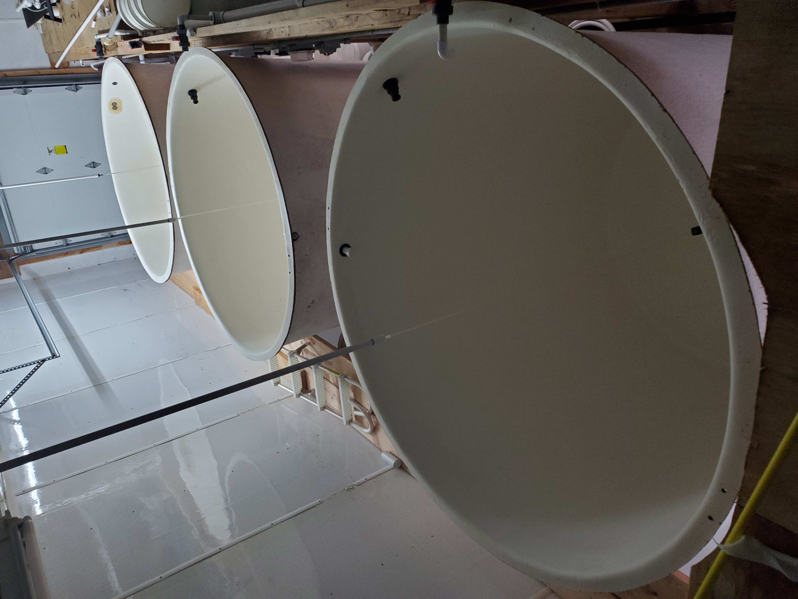 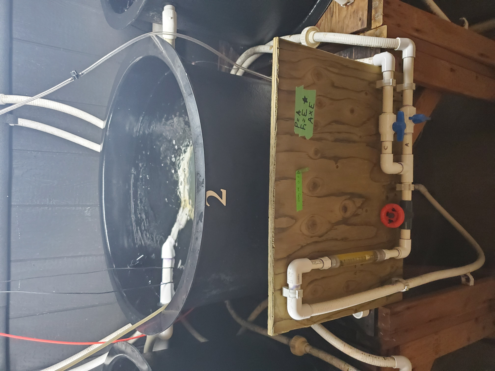 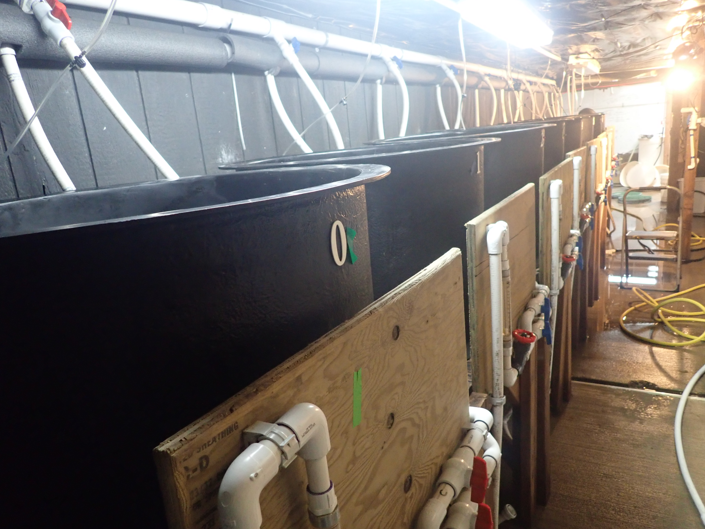

>*photo/image*: larval-rearing tanks at Jamestown Point Whitney Shellfish Hatchery in Brinnon, WA (USA). Shown here are large 2k-L tanks used for the initial metamorphosis of fertilized embryos to free-swimming trochophore larvae. This system involved two flat-bottomed conicals that invovle a on-way flow between them so that allow metamorphosed, free-swimming, larvae will eventually stock a single conical whereas delayed/dead embryos remain in the other (left). Center and right are small 250-L conicals used for small batches of larvae - typically hatcheries used larger conicals >=750L conicals for their larvae. At the Jamestown hatchery, these 250-L tanks were used for collaborative experiments.

#### Downwellers

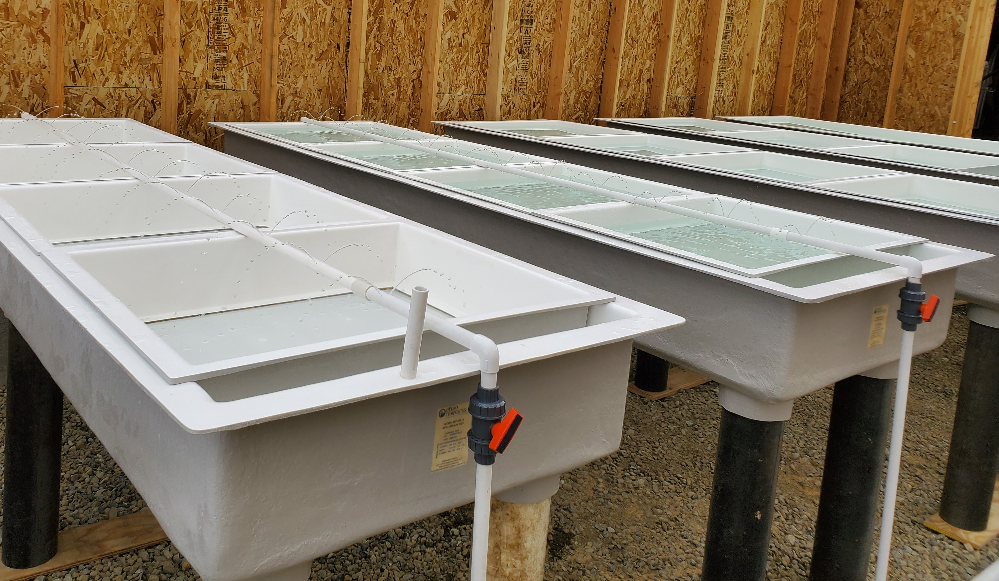  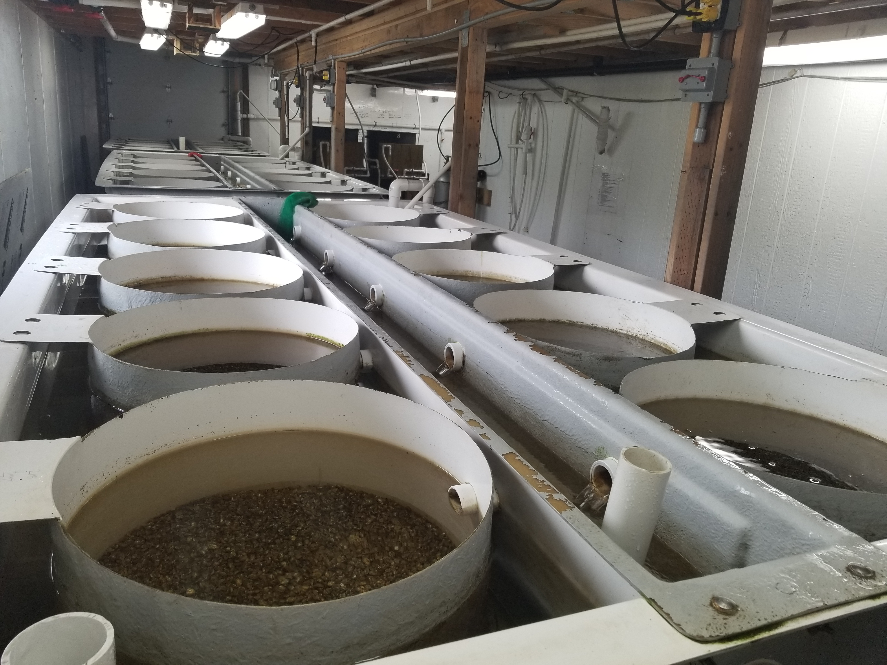 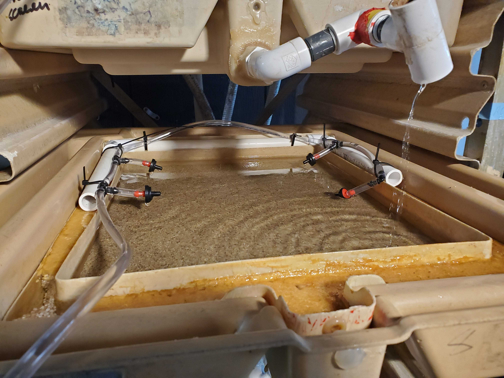

>*photo/image*: Once larvae reach settlement and begin burrowing (indicated by the protruding foot at the pediveliger stage; see I.3 LArvae and Seed, 'Settlement') they are added to  systems such as raceways (left), "three or four-holer downwellers" (center), or heath trays (right). Normally heath trays operate on a flow-over system with seawater ascending top-down in a stack of trays - here (right) heath trays were fitted with a new outflow and inflow to create small-scale downwellers used in collaborative experiments on juvenile geoduck at the hatchery!

## I.2. Broodstock Conditioning & Natural Spawning

#### Broodstock collection and conditioning:
Broodstock are adult animals either grown or wild caught for spawning in the hatchery. Large-scale hatcheries with the space and resources often collect numerous broodstock from multiple regions to maintain genetic diversity and 'hedge their bets' for spawning.

Pacific geoduck reproduce sexually and are broadcast spawners, meaning males and females release gametes in the water column and rely on the simultaneous release from both sexes for fertilization in open water. In aquaculture, wild or grown broodstock are collected as early as late-Fall and brought to the hatchery. 'Broodstock conditioning' is the process by which hatchery technicians prepare adults for spawning to increase reproductive success and offsrping survival. The timing for 'broodstock conditioning' targets the vital period of 'gametogenesis' or the period during which gametes, especially eggs, are developing and multiplying in adults. A rich diet of algae loaded with essential fats does the trick - it is common to feed broodstock for a few months over gametogenesis before the first attempt at spawning. In addition, a growing field of research suggests that stress from the envrionment can also affect spawning, reproduction, and offsrping survival! (*some resources on this below*)

> *Food for thought: read the referenced papers below to learn more about how diet & the environment affects bivalve offspring*
  >  - Utting, S. D., & Millican, P. F. (1997). Techniques for the hatchery conditioning of bivalve broodstocks and the subsequent effect on egg quality and larval viability. Aquaculture, 155(1-4), 45-54.
  >  - Parker, L. M., Ross, P. M., O'Connor, W. A., Borysko, L., Raftos, D. A., & Pörtner, H. O. (2012). Adult exposure influences offspring response to ocean acidification in oysters. Global change biology, 18(1), 82-92.
  >  - Parker, L. M., O’Connor, W. A., Raftos, D. A., Pörtner, H. O., & Ross, P. M. (2015). Persistence of positive carryover effects in the oyster, Saccostrea glomerata, following transgenerational exposure to ocean acidification. PLoS One, 10(7).
  >  - Parker, L. M., O'Connor, W. A., Byrne, M., Coleman, R. A., Virtue, P., Dove, M., ... & Ross, P. M. (2017). Adult exposure to ocean acidification is maladaptive for larvae of the Sydney rock oyster Saccostrea glomerata in the presence of multiple stressors. Biology letters, 13(2), 20160798.

#### How to Induce Natural Spawning:

- ##### dramatic increase in diet:
 Spikes of algal density can provide the spark technicians need to elicit a planned spawning event. A few gallons of dense batch culture are simply added to broodstock tanks.
- ##### simulate tidal cycles / handling stress:
 Another method is a short-term exposure out of water. Tanks are rapidly and completely drained. An added benefit of this technique is that broodstock can be removed from the tanks entirely. this permits technicians to wash the tank of faeces and algae biolfilms to ensure optimal conditions for spawning and gamete quality when released. It must be noted that this process is stressful for broodstock and may induce lethal harm if repeated in quick succession or prolonged for extended periods of time.  In combination with diet, high algae culture can be added with the seawater upon re-filling to trigger spawning.
- ##### add gametes:
 An artifact of natural spawning is the common scenario of non-simultaneous release of gametes from both males and females. If either sex has released gametes, a sample of this seawater rich in egg or sperm cells can be added to a broodstock tank to trigger additional individuals to spawn. A major caveat here is that you will likley have successful fertilization in the borodstock tank (added sperm activated female to release eggs), thus removing and isolating spawning individuals to a bucket/isolation tank can allow a hatchery to control fertilization and optimize genetic diversity.

 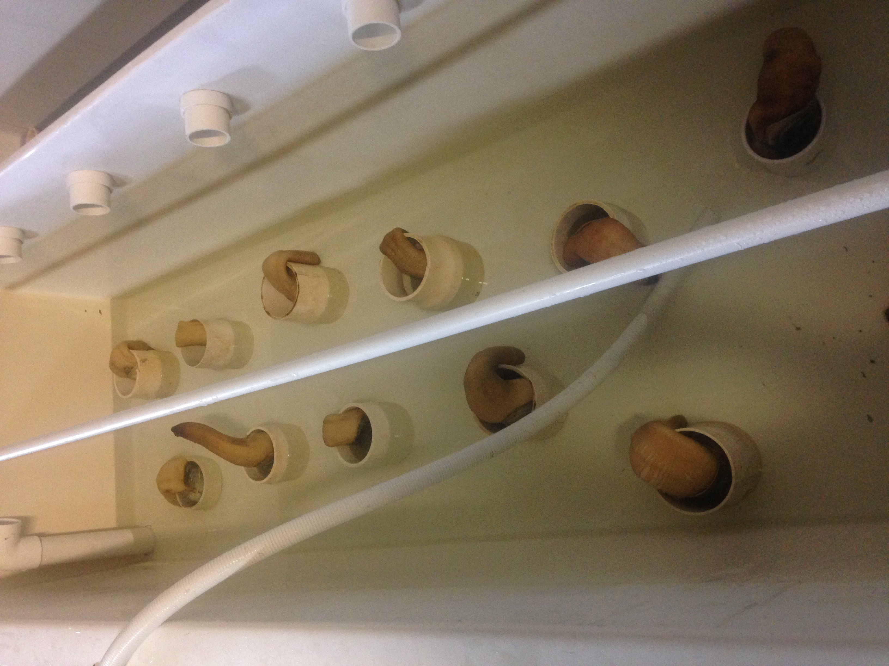 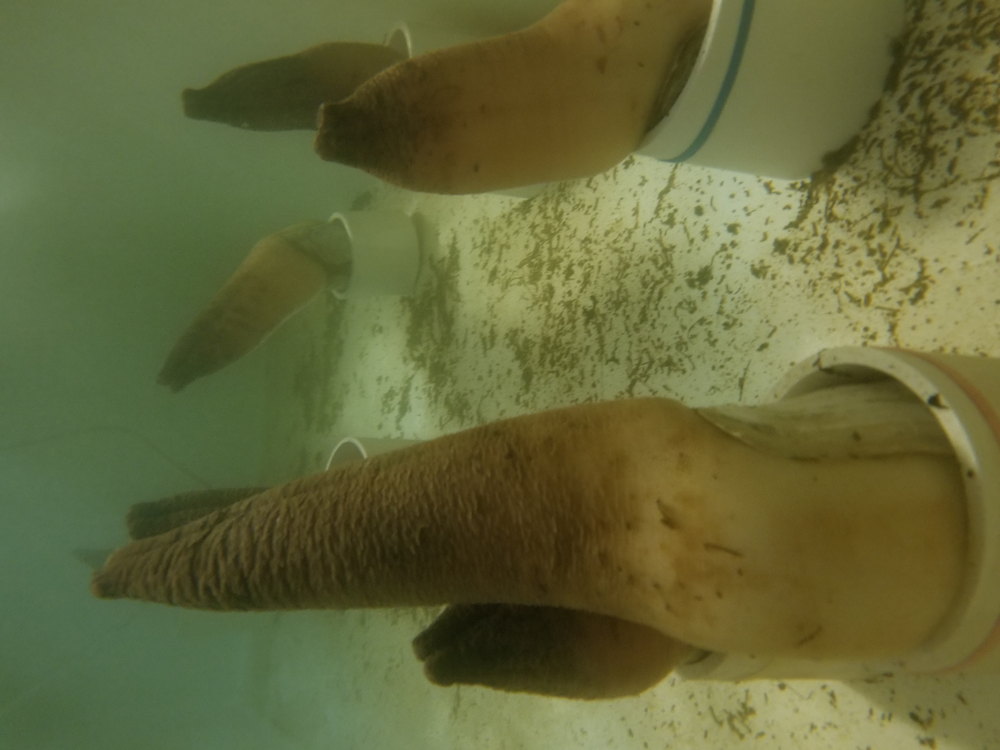

> *photo/image*: shown above are adult geoduck in broodstock tank, drained of seawater to simulate a tidal cycle to induce spawning. Animals in this example are placed in individual pvc cups to monitor spawning for an experiment - note that production typically attempts spawns with a much higher numbers of adults.

## I.3 Larvae and Seed

### Free-swimming larvae:

*off with a bang!*

Rearing season call for all hands on deck, as embryos and larvae are a tall task. Once fertilized, embryos quickly metamorphose to trochophores and proceeding stages (e.g. prodissoconch I and II) over the course of days to weeks. These larvae are free-swimming requiring specific rearing practices and tricks for successful development.

> *REMEMBER!* conicals and upwellers are used to rear free-swimming larvae. Larval rearing conicals are periodically drained to assess the larvae and get valuable information to answer the following questions...
- Are the larvae developing/metamorphosing to the next stage?
- Have the larvae survived/What are their numbers compared to the previous stage?
- Are we (the hatchery/business) meeting our production timeline?

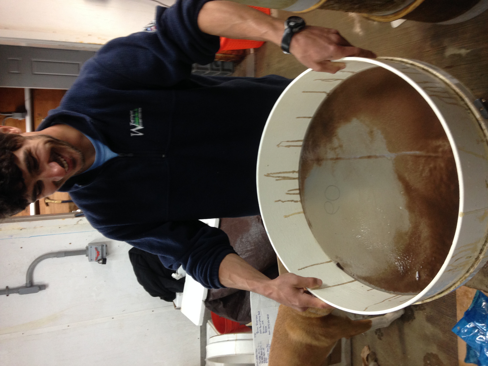 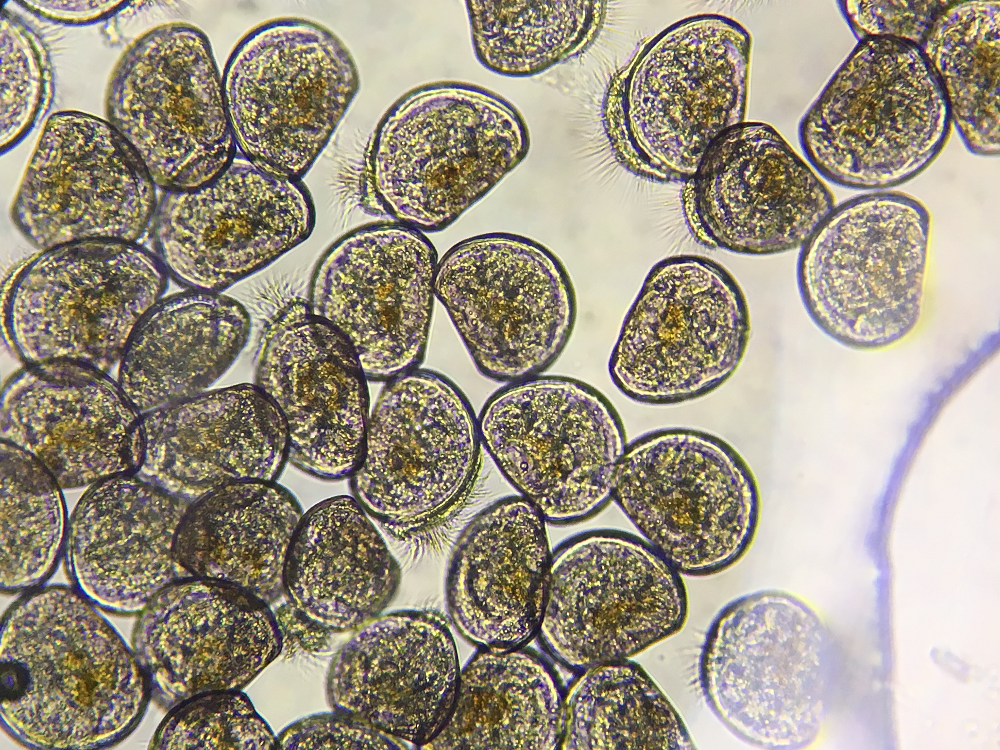 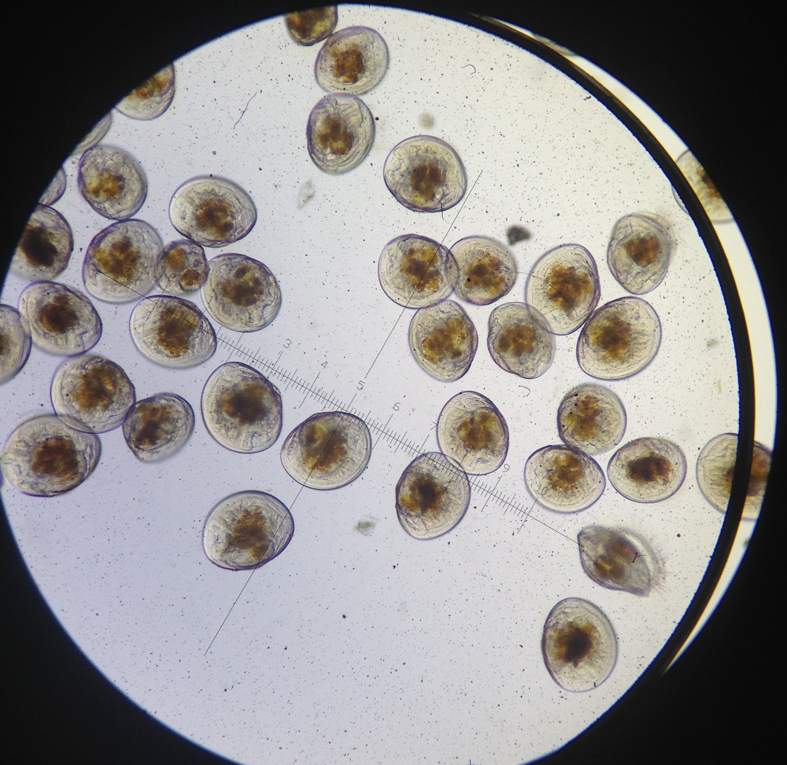

>*photo/image*: (left) Mat Henderson, hatchery manager at Jamestown Point Whitney Shellfish Hatchery, rinsing a 20µm seive (lefts) with millions of D-hinge geoduck larvae (center), these will soon develop to umbone 'mature' larvae (right).

### Settlement:

*'There's digging afoot!'*

No longer free-swimming, a clear indicator that larvae have reached settlement competency is when technicians see small dots lining the inside of the larval rearing conicals. These are the larvae at pediveliger stage when individuals start protruding their foot, this is a muscular structure to allow the animals to begin burrowing!

> A major transition in rearing tanks occurs when larvae are no longer free swimming and settle in the tank(s). Instead of conicals or upwellers, the now pediveliger larvae are grow in down weller systems or raceways.
Review I.1 The hatchery, for pictures and details

Under common ambient temperatures for geoduck production (~14-16 Celcius), larvae reach 'settlement' at around 28-30 days after fertilization. Whereas each proceeding metamorphic stage during larval rearing can yield major losses, the settlement stages have greater survivorship and higher tolerance to stress!

 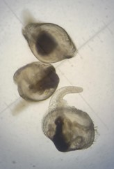

> photo/image: Now over the hurdle, hatchery personnel take a well-deserved *sigh* of relief when larvae reach the pediveliger stage!

### Seed:

 *Plant or product!*

After a couple short months in downwellers or raceways, the now **juvenile geoduck or 'seed'** are ready to sell or plant. Some aquaculture facilities may specialize in seed production or may purchase seed to solely grow market-sized adults, whereas larger practitioners may encompass the entire process from reproduction, seed, and consumable product.

 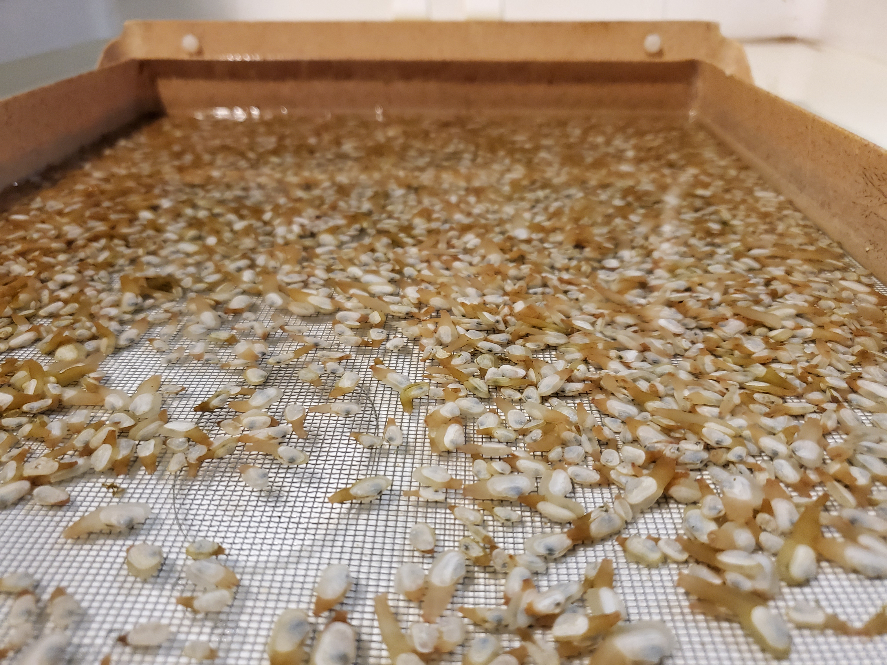  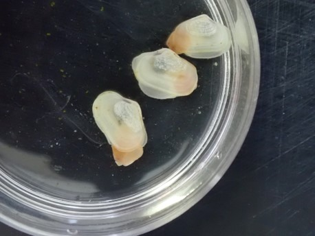  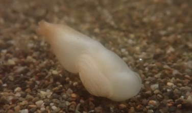

> photo/image: Juvenile geoduck at seed stage are roughly 4-8mm and can be managed by hand to plant.   

## I.4 Grow out

*Dig deep and grow slow..*

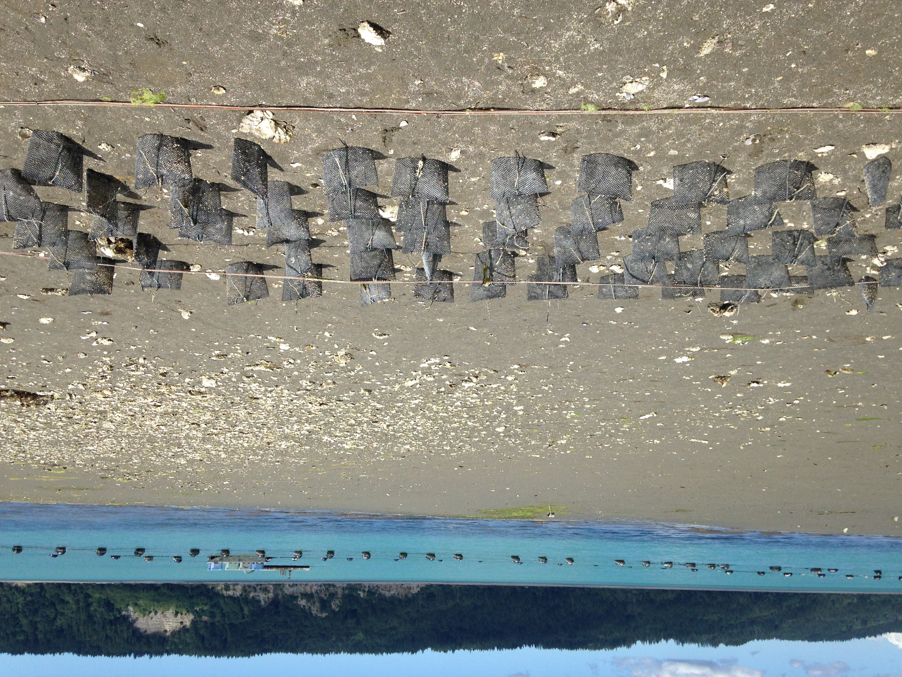

Hatchery producers work alongside growers to sell  seed for 'grow-out'. 'Grow-out' is the process of planting goeduck on the beach. Once burrowed, geoduck are increasingly sessile, meaning that an individual will borrow deeper at it grows but remain in the same burrow for the rest of its life. The process is fairly simple, three seed are planted on each position (show my mesh bags in the above image) within a covered PVC or mesh lining to prevent predation. Once one year in age, it is assumed that survivors are burrowed sufficiently deep in the sediment to remove these barriers and their burrows will remain untouched for several years until market size (4-7 years!). The commercial value of adult geoduck is primarily driven by consumers and international trade. Large-scale industries  often have the infrastructure and land to both rear and grow their own seed encompassing all aspects of production, however growers are also common in the Pacific Northwwest and solely purchase seed from local hatcheries.

Table: Timeline of geoduck production

Production stage | Setting  | Timeline
---   | -----| ----
Spawning & Broodstock conditiong  | Hatchery  | 2-4 months
Fertilization-juvenile |  Hatchery  |  0 to 5-7 months
Grow-out  |  Beaches/mudflats  | 4-7 years

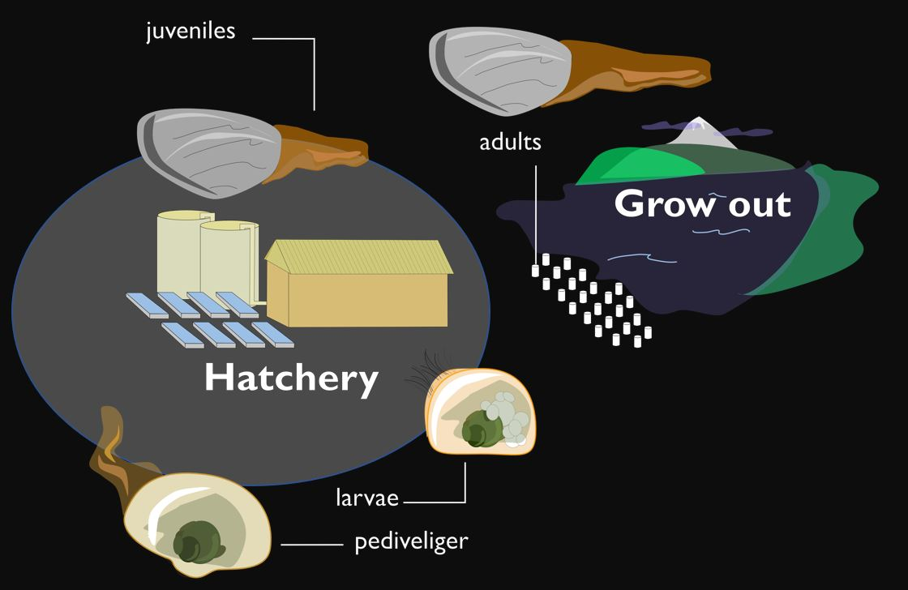

> *Food for thought..*
- The table and cartoon above demonstrate the timing and significance of the hatchery relative to the grow-out period. As one can see, the hatchery presents a short window (5-7 months) relative to the entire life history of geoduck (up to 168 years) and the market timeline (up tp 7 years!!).

## I.5. Production enhancement

*always room to improve..*

Let's synthesis some main aspects of geoduck aquaculture.
This entire process can be divided into **two main phases**:
- **the hatchery** = controlled systes for *months*
- **grow-out** = field for several *years*

**Unique to the hatchery phase...**, this comparatively short window occurs when animals are both highly susceptible to stressors (young stages of development) and *in the hands of hatchery technicians*

*What strategies can be implemented at the hatchery to improve production?*   

#### Bottleneck for production:

*These little ones are a picky bunch!*

Larvae in particular are *highly susceptible* to a wide variety of stressors (e.g. diet, temperature, pH, salinity, pathogens, etc.). *Hatcheries face major losses* and occasionally ubiquitous mortality of entire cohorts due to even subtle changes!

**Below are several common methods to improve production:**

- ##### Water quality monitoring
hatchery personnel can not change seawater conditions out in the bay or estuary, but they can *improve awareness* of changes in *real-time!*. Recent research in the Pacific Northwest of the United States found seawater low in aragonite saturation state and pH caused shell malformations and mortality of Pacific oyster larvae. To remedy this issue, an Oregon (USA) hatchery deployed water chemistry *sensors to monitory their inflow* and the coastal conditions - this allowed hatchery personnel to adjust the timing of their pumps to avoid corrosive seawater with a low pH!

- ##### Buffering
in some cases, the hatchery can *alter the seawater* below exposing animals to potential harm. Sodium bicarbonate is an example of a chemical bioremediation strategy to avoid exposing shellfish to low pH conditions. As a popular method to cope with low pH seawater, hatcheries *mix the inflow with sodium bicarbonate to raise the pH* and aragonite saturation state to allow the shellfish to build their shells and develop normally. This technique has shown great success, boosting production by 30-50% in areas susceptible to ocean acidification!

- ##### Culling
as larvae develop and tanks are periodically drained to count them and maintain their tanks, the *slower growers (runts) are set aside or removed*. The omission of these animals is called culling. Hatcheries perform culling as *a common housekeeping process* to reach their production timeline and avoid further - this is especially prevalent in larger industry hatcheries that can cut their losses with the space to accommodate the slower-growing larvae. However, *small-business hatcheries may not afford to cull larvae* or an only apply more conservative thresholds.

- ##### Selective breeding
this strategy targets *resilient strains* (e.g. disease and environmental stressors) and economic traits (e.g. faster growers) to improve production. Broodstock with are selected due to their *better survivorship and/or developmental rate*, for examples, to produce offspring under the assumption that the probability is higher that offspring will express the same attributes.

-  ##### *Warning!*, enhancement comes with cons...
culling may result in a *genetic bottleneck* (faster growers are from one parental line/population) and adds a *human bias* as slower growers may outpace others at later life stages, also known as a compensatory growth response. Further, an optimal stress-free environmental over hatchery rearing can lead to *domestication selection*, leaving animals unprepared for dynamic conditions inevitable faced later in life over years of growth outside the hatchery!

> *Food for thought..*
- As for Pacific geoduck, animals are in human hands at the hatchery for the initial 5 months after fertilization. At the 'seed' stage geoduck are planted and succumb to the natural environment for roughly 4-7 years until harvested!!
- No single method is an 'end all' solution! Outcomes of any adjustment or enhancement strategy are likely to be specific to the region or hatchery! Especially with jobs and profit at risk, it is critical to prototype and run small-scale tests of any changes to standard protocols.

# II. Broodstock & Spawning Enhancement Strategies

Geoduck hatcheries face an array of concerns during the spawning season...

- (1) Sex and reproductive status of adult geoduck *remain largely unknown*

  To spawn adult geoduck, large tanks are stocked at high density of adults and fed high algae density to 'bulk-up' animals' reproductive status (increase development of eggs and sperm). However, unknown to hatchery managers and technicians are the sex distribution of geoduck in their tanks and their reproductive status. These essential factors remain unknown until individuals spawn, revealing their sex and status, or if animals are selected for lethal sampling before spawned. Alternative non-lethal methods can avoid costs associated with lethal sampling and allow hatcheries to sample periodically in preparation for spawn(s).

- (2) Spawning attempts are *sparsely successful and temperamental*

  Spawn days are scheduled, but rarely go as planned. Like a homegrown recipe, hatcheries have their 'secret sauce' during spawning season, consisting of algae slurries, physical disturbance, simulation of tidal cycles, ramping temperature, or a lucky hatchery technician who, for some unknown reason, is the geoduck spawn whisperer (Josh Valley at Jamestown Point Whitney Shellfish). Whichever method deployed on spawn day, geoduck often refuse to produce, leading to frustration and unfruitful allocation of effort (likely financial costs).In an ideal world, the time scheduled to spawn, fertilize, and stock larval-rearing conicals would be predictable and acheivable in a standard work day. In reality, hatchery technicians may spend the day attempting a spawn only to return in the late nigh/early morning hours when individuals sporadically release their gametes.  

**in this section...** we describe a few tools geoduck industry can use to improve the broodstock conditioning and spawning phases - these include non-lethal gonad biopsies and a stepwise outline for strip spawning broodstock.

## II.1 Identification of Sex & Reproductive Status

A major artifact of geoduck aquaculture is the *spontaneous and opportunistic nature of natural spawning events*. For example, an *unplanned* nighttime natural spawn of a female geoduck set the stage for the growing season at Jamestown Point Whitney Shellfish Hatchery in winter 2019 (*Mat Henderson, personal communication*). Millions of eggs (~30) were released into a single broodstock tank with two dozen other animals (of unknown sex) and under seawater flow-though. In an optimal scenario, technicians would have isolated the spawning female to a static tank to control spawning/fertilization and maximize  egg yield. This event lead to a totally autotomous fertilization process outside of standard 9:00am - 5:00pm work hours. In most cases, spontaneous and unplanned spawning presents major loss in potential profit - luckily, personnel at JPWSH live on site and were able to salvage fertilized embryos.

Losses in production and profit are unfortunately common in shellfish aquaculture. In the story stated above, aquaculture technicians were limited by two main factors:
- **sex identification of broodstock**: The sex is unknown to hatchery personnel and is only reveled once an individual starts releasing gametes
- **reproductive status of broodstock**: Wild adult broodstock clams are typically collected in early winter and are fed algae-rich diets at the hatchery for several weeks/months to hasten reproductive status. However, the optimal timing to allocate time and effort for spawning attempts remains poorly understood.

#### We deployed new techniques to track adult geoduck

Trait  | Importance in Aquaculture | Technique | Note
------------- | ------------- | ---------- | ----|
**Sex of broodstock groups** | avoid spontaneous spawning and fertilization; enhance control of spawning attempts | **gonad biopsy** | invasive sub-lethal
|  |   |   |
**Reproductive status** | determine optimal timining for spawning; identify individuals to focus spawning efforts; control and increase diversity| **hemolymph extraction (vitellogenin)**, **gonad biopsy** | minimially invasive; invasive sub-lethal

### II.1.1 General Procedure: Gonad Biopsy

##### About:

To identify the sex of adult geoduck, animals are randomly chosen for dissection of the gonad. This is a common destructive method, meaning selected animals for this assessment are no longer viable for the hatchery. Alternatively, these randomly chosen animals can be placed back into the broodstock tanks and spawned. We tested the practical application of gonad biopsies in a hatchery setting to both identify sex and reproductive status in randomly chosen adult geoduck during spawning season.

##### Materials:

- disposable biopsy punches
- compound light microscope (40x-1000x magnification)
- glass slides
- disposable pipettes (1 ml)
- kimwipes/paper towels
- DI water

##### Steps:

  1. Prepare a wet space and dry space for biopsies (wet) and microscopy (dry)

  2. Randomly select a group (2-3) of adult geoduck from each tank/population and position in your wet work space noting their order/position to return later the correct tank/treatment/population/etc.

  3. Select a geoduck for the biopsy, position the siphon facing away and the shell downward. It is easiest to hold the geoduck shell on your palm to perform the biopsy. You should have the pedal gape facing you, tissue facing upward, and siphon facing away (shell in your hand).

  4. Insert a new biopsy punch into the pedal gape - at ~3-4 cm you should feel a slight resistance from contact with the gonad. Gently push the biopsy tool to perform a punch of the tissue and remove the tool. If performed correctly, a piece of tissue will be captured in the biopsy tool. If no tissue is present, repeat and gently insert further to reach the gonad.

  5. Dispense the sample on a slide, the sample will likely be both solid (tissue) and aqueous. Using a disposable pipette, transport some of the aqueous sample to another slide for microscopy.

  6. Focus the compound microscope to view your biopsy sample. What do you see?
    - eggs = large circular cells about 10um diameter; cells may also be oblong or teardrop-shaped.
    - sperm = cells are quite small may not be clearly visible! Add a drop a seawater to active the sperm. You may view a static sample come alive as sperm are activated by the seawater and begin moving! Note: this active state is temporary

  7. Repeat for remaining randomly selected adult geoduck. Make note of their sex and reproductive status. Mark the animals selected for the biopsy to keep track of them leading to spawning - this can save effort and time now knowing both their sex and status!

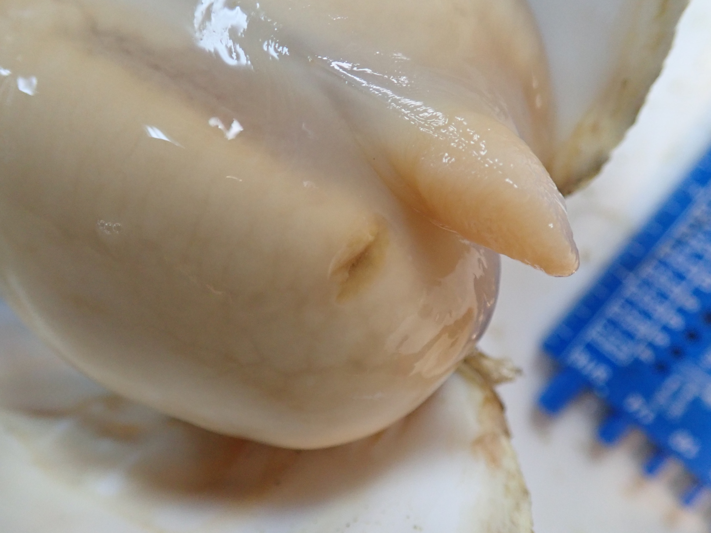

> photo/image: above shows the removed gonad of an adult geoduck that was chosen for a gonad biopsy before sampled destructively for strip spawning. Note the reduced foot, adult geoduck are sedentary in their burrows and no longer require the ability to dig - thus their foot becomes heavily diminished leaving adults unable to burrow back down!

### II.1.2 General Procedure: Hemolymph Extraction (Vitellogenin)

## II.2. Strip Spawning

*plan your spawning timeline to the minute!*

##### About:

Strip spawning is a destructive method for spawning geoduck, meaning all chosen animals are dissected and sacrificed. Therefore, is it ideal to both identify the reproductive status and sex during broodstock conditioning (i.e. gonad biopsy and/or hemolymph extraction) and tag animals . As opposed to natural spawning, strip spawning may save both time and effort by planning fertilization and larval rearing.

##### Steps:

  1. *Weeks before strip spawning* Identify the sex and reproductive status of broodstock. Are animals far along and prepared to spawn? Complete gonad biopsies and use microscopy to observe eggs and sperm. Activate sperm with seawater to assess sperm motility!
  2. Prepare working space for strip spawning. This includes table space, access to 0.2µm filtered seawater, KCl solution, 20µm seives (2-3), seawater table/large tray, access to compound microscope with slides, pipettes, and beakers.
  3. Remove chosen males and females from the broodstock tank (identified weeks beforehand with invasive or non invasive reproductive status assessments)
  4. Dissect broodstock tissu. Cut along the interior shell with a curved spatuala to remove the entire body. Remove the gonad and set aside in a marked position (i.e. a beaker labeled Female # 2)
  5. With a clean scalpel blade, cut shallow striations/hashes along the entire gonad. Work slowly over a rinsed beaker. Gametes will secrete from the tissue. You can also use the blunt side of the scalpel to sweep the striations to increase secretion and hasten this process.
  6. If strip spawning a female goand, use 0.2µm-filtered seawater in a squirt bottle as you strip spawn. Eggs must be in seawater to ensure viability downstream. In contrast, DO NOT use seawater while strip spawning male gonads. This will activate the sperm and leave serm cells unviable when used for fertilization. Strip spawn the male gonad without seawater into a dry beaker and leave fridgerated at 12-14C until all eggs are prepared for fertilization.

  NOTE: all individuals should have a seperate beaker - do not mix gametes

  7. After a female gonad is deplete, add more seawater to the beaker to hydrate eggs. Hydrated eggs appear as nearly perfect circles under microscopy whereas eggs without seawater will appear elongated. Pippette samples and check them after 5-10 minutes.
  8. Once hydrated, eggs are ready for activation. Add KCl to egg batches to target a concentration of 0.1 M KCl, mix gently, and let sit for 15-20 minutes.
  9. Rinse egg batches (seperately per individual!) on a 20 µm seive with filtered seawater. The objective of this step is to remove the KCl and prepare eggs for fertilization. Rinse eggs off the 20 µm seive into a beaker with 0.2 µm filtered seawater.
  10. Activate sperm with seawater and fertilize eggs with small aliquots. Use microscopy to check the eggs after sperm is added (~5-10 minutes). Polyspermy must be avoided and occurs when eggs are overencumbered by sperm leading to low fertilization rate. An optimal range is ~10-30 sperm around each egg.

  NOTE: remember to cross all males with all females to increase diversity!

#### Photos:

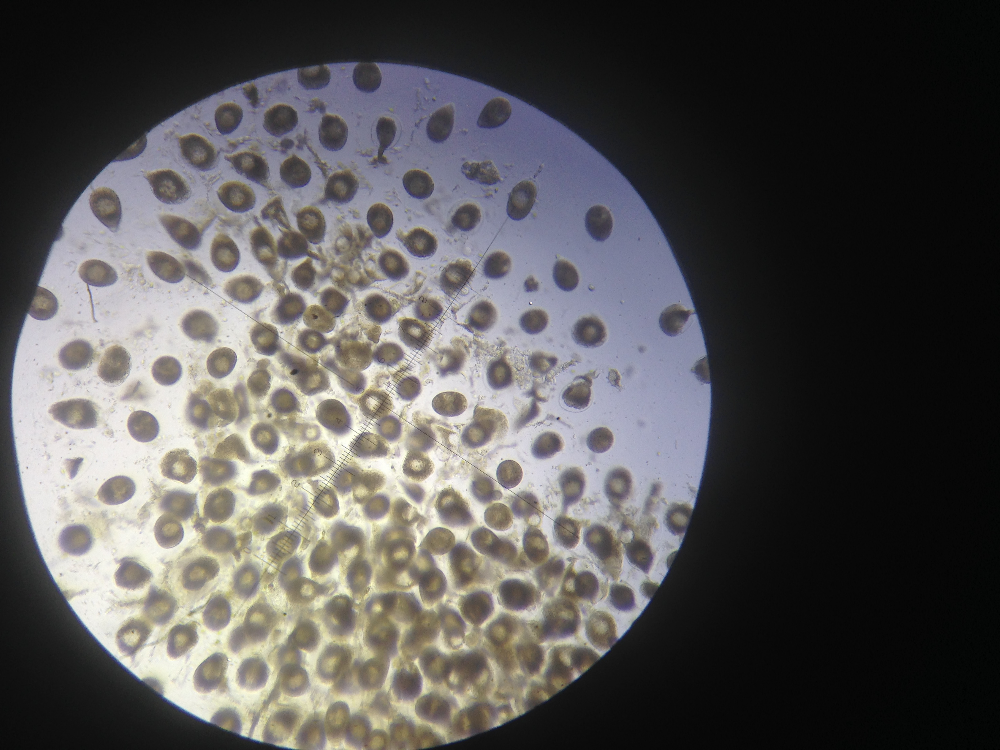 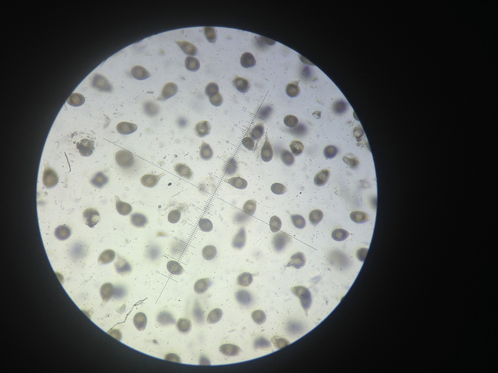

> photo/image: above show unhydrated eggs from a strip spawn. Notice that eggs appear elongated and are aggregated.

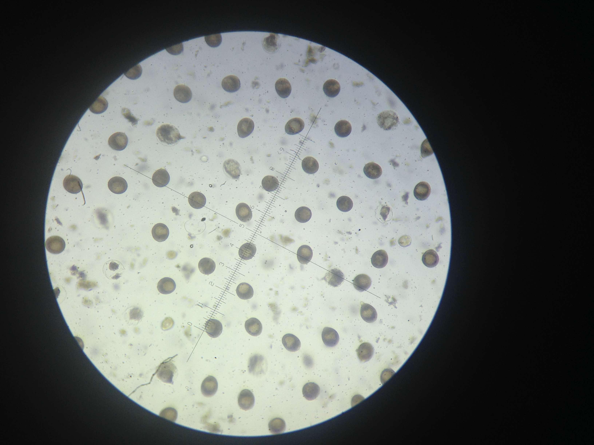

> photo/image: above shows strip-spawned eggs both hydrated and activated with KCl. These 'primed' eggs are nearly perfect circles due to hydration and appear evenly seperated relative to the eggs in prior photos (above).
> eggs are now prepared for fertilization with the activated sperm. Sperm is activated rapidly by adding seawater. It must be noted that sperm viability is best after initial activation. To increase successful fertilization, sperm should be activated immediately prior to being added to batches of eggs.

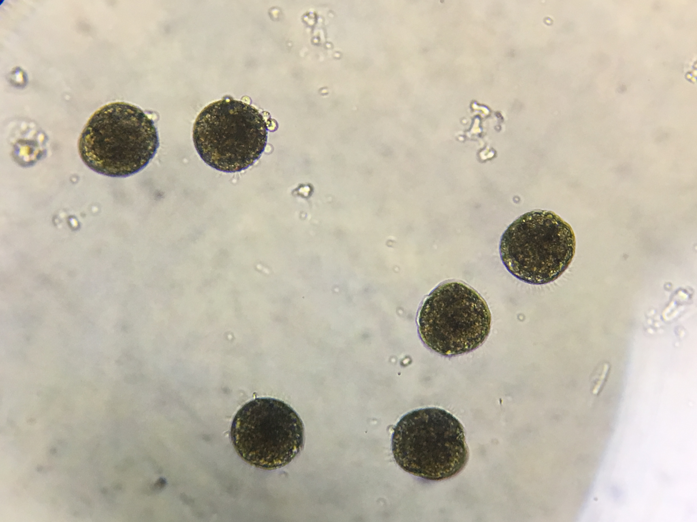

>  photo/image: embryos metamorphose to free-swimming larvae only a few hours after sperm is added

## II.3. Takeaways for Aquaculture

In this brief section, we discuss our alternative and non-lethal trials to identify sex in broodstock groups and assess their reproductive status. We also outlined our strip spawn trial that produced viable offspring at the hatchery. Altogether, we found gonad biopsy through the pedal gape successfully identified sex and reproductive status, suggesting that these biopsies are a minimally-invasive and non-lethal alternative to sacrificial sampling. Moreoever,,, **expand here on the vitellogenin work - contact Shelly Trigg to add here if she has info**

# III Climate Change & Aquaculture

Climate change exerts growing pressures to marine life and is projected to intensify
in the near-future.

> *Food for thought*: read the referenced papers below to learn more about the effects of climate change on sustainable shellfish industry and novel methods to combat them!
>
>   -  Allison, E. H., Badjeck, M. C., & Meinhold, K. (2011). The implications of global climate   change for molluscan aquaculture. Shellfish aquaculture and the environment, 461-490.
>   -  Chandhini, S., & Rejish Kumar, V. J. (2019). Transcriptomics in aquaculture: current status and applications. Reviews in Aquaculture, 11(4), 1379-1397.
>   - Froehlich, H. E., Gentry, R. R., & Halpern, B. S. (2018). Global change in marine aquaculture production potential under climate change. Nature Ecology & Evolution, 2(11), 1745-1750.
>   - Gavery, M. R., & Roberts, S. B. (2017). Epigenetic considerations in aquaculture. PeerJ, 5, e4147.
>   - Nascimento‐Schulze, J. C., Bean, T. P., Houston, R. D., Santos, E. M., Sanders, M. B., Lewis, C., & Ellis, R. P. (2021). Optimizing hatchery practices for genetic improvement of marine bivalves. Reviews in Aquaculture.
>   - Pernet, F., & Browman, H. I. (2021). The future is now: marine aquaculture in the anthropocene.

## III.1. Ocean Acidification

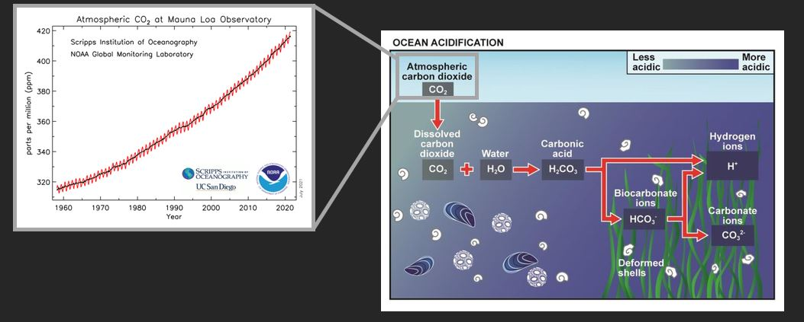

*Citation(s): Birchenough, S., Williamson, P., Turley, C., (2017).
Future of the Sea: Ocean Acidification, Government Office
for Science, 19*

In particular, global environmental phenomena such as ocean acidification, or the reduction of ocean pH due to absorption of atmospheric CO2, and increasing marine heat waves are devastating marine life and thus ocean ecosystems.

>It is estimated that nearly 25% of the carbon dioxide (CO2) emitted by human activity since the industrial revolution has since diffused into the global ocean!

Although the ocean acts naturally as a carbon sink, this excess carbon dioxide results in hypercapnic (high CO2) conditions leading to disruption in the carbon cycle - hydrogen ions in seawater (the 'H' in H2O) disassociates from a bound state, increasing the amount of free H+ in the seawater. Elevated hydrogen ions *decreases pH*. Similar to the 'buffering' role of the ocean for atmospheric gases, the ocean also buffers against low pH conditions, however the excess amount of free hydrogen ions *compromises the availability of calcium and calcium uptake for hard shell organisms!*

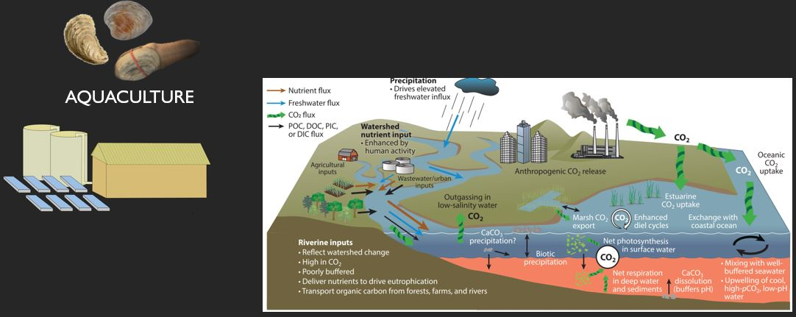

*Citation(s): Cai, W. J., Feely, R. A., Testa, J. M., Li, M., Evans, W., Alin, S. R., ... & Bednaršek, N. (2021). Natural and anthropogenic drivers of acidification in large estuaries. Annual Review of Marine Science, 13, 23-55.*

> *An issue close to home...*
>  - *Ocean acidification is exacerbated in productive coastal systems* such as temperature marine estuaries and bays where high residence time, stratification and eutrophication (coastal run-off enhancing primary productivity) write the perfect recipe for acidification!

> - *Estuarine systems across continental US* (Chesapeake Bay, Puget Sound, Narragansett Bay, Great South Bay, Long Island Sound, etc.) have reported seasonal and daily-cycling low pH conditions especially harmful for calcifying animals!

*Shellfish are at risk, thus aquaculture is forced to adapt!*

Ironically, coastal systems heavily affected by human-introduced stressors are hubs for societal, cultural, and economic importance through sustainable seafood production. This paints an ironic recipe in our coastal communities, enhancing the need for public awareness and action as projected future scenarios bleaker.

In the Pacific Northwest of United States, *hatchery losses* in recent years due to ocean acidification have been dubbed the **"Pacific Northwest Seedstock Crisis"**.. demanding investigation of adaptive resilience to anthropogenic (human introduced) stressors!

## III.2. Future Solution: Stress Priming
> *what does not kill you makes you stronger!*

#### What does this mean?

Stress priming describes the beneficial effects of non-lethal stress (or 'moderate' stress) on improved resiliance or ability to cope with subsequent stress exposure(s) later in life.

> other terms related to priming include  hormesis, preconditioning, developmental acclimatization, and stress hardening.. each with their own important niche, but under the umbrella of this general response!

Did you know? This general response, early-life stress for improved response, is conserved across organisms on planet Earth, meaning that there is supporting evidence in a spectrum of taxon ranging from nematodes to small mammals!

### III.2.1.1 Broodstock

###  a) Gonad histology of conditioned broodstock
> *Reference:*
Trigg S.A., Gurr, S. J., Mitchell K.R., Vadopalas, B., Roberts, S. B., & Putnam, H. M. (*in progress*). Impact of pH stress on reproductive development in the Pacific geoduck (Panopea generosa)

**Objective:** Investigate the effects of OA on gonad reproductive development in an aquaculture setting.

#### Life stages:

- adults (unknown age) collected in the field by geoduck divers and tribal community members of Jamestown S'Klallam Tribe.

#### Treatment(s) and conditioning duration:

|  | pH | Ω aragonite saturation | duration |
| ---------- | ---------- | ---------- | ---------- |
| Ambient  | 7.8 |  1.3 | 101 total days |
| Moderate stress | 6.8 | 0.1 | 93 days preceding 8-days of ambient recovery |

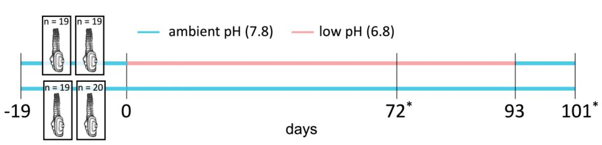

> *figure:* experimental design in the conditioning trails with adult Pacific geoduck clams. Duplicate brodstock tanks were maintained at ambient and low pH conditions for several week. Asterisks (*) represent days when gonad sampls were taken for histological analysis

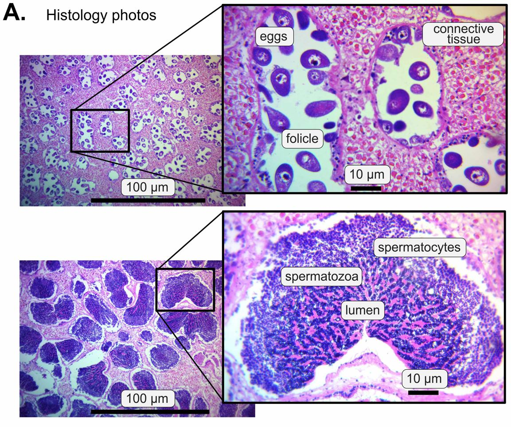

> *figure:* gonad histology samples of a female (top) and male (bottom) geoduck clam with size scale. Labeled terms are key characteristics analyzed via qualitative and quantitative methods to investigate effects of OA on reproductive status.

#### Results:

##### Qualitative staging

Here we see the delay in reproductive development in both female and male geoduck clams

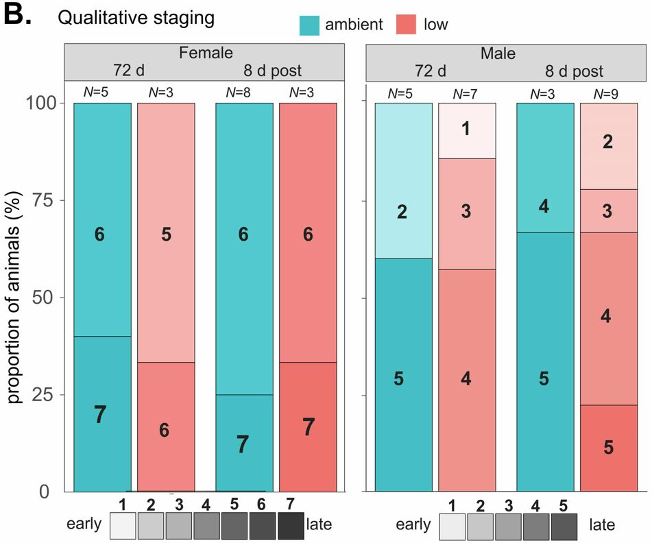

> *figure:* We also analyzed key traits in gonad histology slides quantitatively to compliment staging. Here we see a more in-depth view of physiological characteristics attributed with reproductive status!

##### Quantitative analysis

Looking a bit closer at reproductive status and defined traits...

**Female clams**:

 - proportion of connective tissue and follicle area are important indicators of this delay

**Male clams**:

-  proportion of spermatocytes and spermatozoa are important indicators of this delay

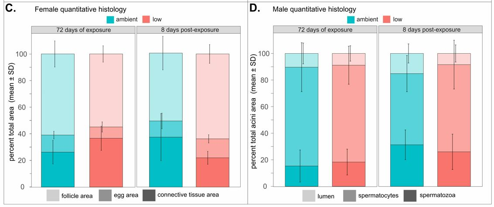

> *figure:* 'Staging' is a common method in histology in which a specified criteria is defined - here shown as light to dark shading (numerical 1-7 for females and 1-5 for males) representative of early to late reproductive development.

#### Summary:

A dramatic decrease in pH over a 2-month period decreased the reproductive development of gonad tissues, delaying maturation of both egg cells and spermatozoa in Pacific geoduck.

*Questions moving forward..*

We saw a compensatory 'catch-up' of egg numbers, does this suggest that prolonged exposure as opposed to acute stress may have different effects on reproductive development?

Considering the delay in proportion of spermatozoa via histological analysis, how does intracellular acidosis affect the transition of spermatocytes to viable sperm?

### III.2.1.2 Larvae and Juveniles

###  a) Repeat exposure experiment:

> *Reference:*
Gurr, S. J., Vadopalas, B., Roberts, S. B., & Putnam, H. M. (2020). Metabolic recovery and compensatory shell growth of juvenile Pacific geoduck Panopea generosa following short-term exposure to acidified seawater. Conservation physiology, 8(1), coaa024.

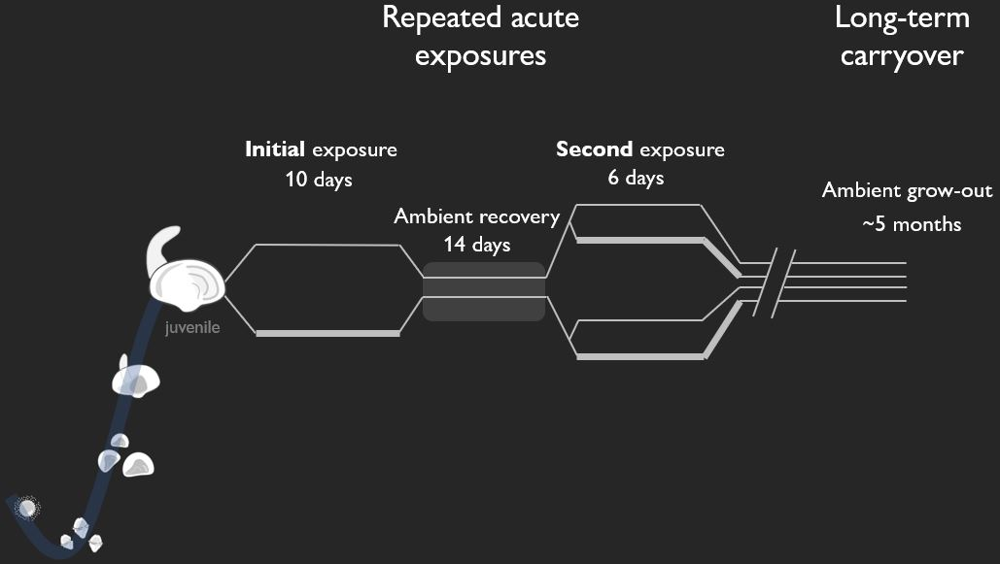

Juvenile geoduck *reared under standard hatchery practice* were exposed to a  acute exposures of low pH conditions to measure physiological effects of repeat stress and carryover effects of stress history on subsequent response. After the repeat exposures, animals were reared for 5 months to measure carryover effects.

#### Life stages:

- juveniles, 5-10 months post-fertilization

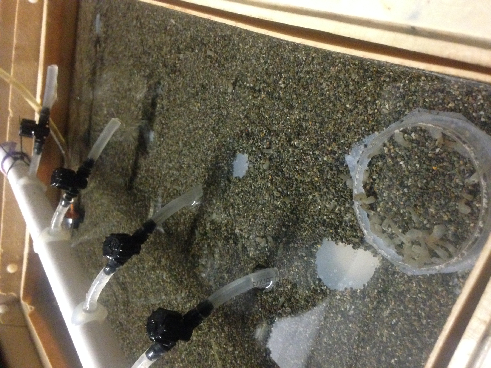

> *photo/image:* ~3-4-month juvenile geoduck in isolated cups to measure respiration rate and shell growth periodically over the repeat exposures (above).

> *photo/image:* ~9-month-old juvenile geoduck reared under standard hatchery practice in a heath tray after the repeated stress periods (above).

#### Treatment(s):

|  | pH | Ω aragonite saturation |
| ---------- | ---------- | ---------- |
| Ambient  | 7.8 |  1.3 |
| Moderate stress | 7.2 | 0.4 |

#### Results:

| measurement | response |
| ---------- | ---------- |
| survival   |   no mortality after repeated short-term exposures (6 - 10 days) |
| respiration rate |  initial 25% decrease, **able to recover** and cope with short-term stress; evidence of **"memory" and positive carry over** later in life |
| shell growth | initial decrease 3.6% length, but **compensatory growth** reveals benefits of early life exposure |

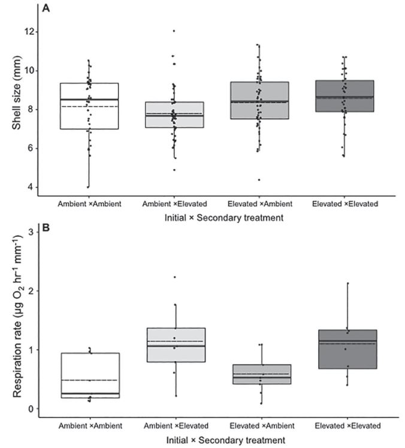

> *figure:* Shell length and respiration rate data nearly ~5 months after exposed to repeated OA stress. Here we see animals that experienced early-life stress periods were larger and have higher respiration rate - from Gurr et al. 2020

#### Summary:

We sound evidence that juvenile Pacific geoduck have a high capacity to cope with short-term acidification. All tested animals survived the 30-day experiment demonstrating resilience to low pH and reduced carbonate saturation.

Under an initial acute stress for 10 days, juvenile geoduck exhibited metabolic depression, but recovered from this status under repeated stress. Moreover, animals repeatedly exposure to OA stress were significantly smaller than controls, but showed compensatory growth after 5 months under ambient conditions surpassing the shell length of controls. This suggesting stress ‘memory’ and compensatory growth as possible benefits of early stress priming!

###  b) Stress conditioning on subsequent response:

> *Reference:*
Gurr, S. J., Trigg, S. A., Vadopalas, B., Roberts, S. B., & Putnam, H. M. (2021). Repeat exposure to hypercapnic seawater modifies growth and oxidative status in a tolerant burrowing clam. Journal of Experimental Biology.

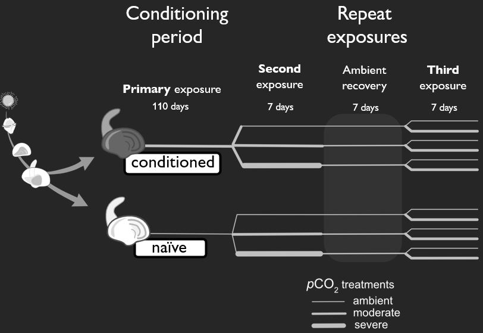

Juvenile geoduck *reared under standard hatchery practice* were exposed to a  acute exposures of low pH conditions to measure physiological effects of repeat stress and carryover effects of stress history on subsequent response. After the repeat exposures, animals were reared for 5 months to measure carryover effects.

#### Life stage:
 postlarval 'settlement' stage (30 das post-fertilization) to juvenile stage (~5-6 months post-fertilization)

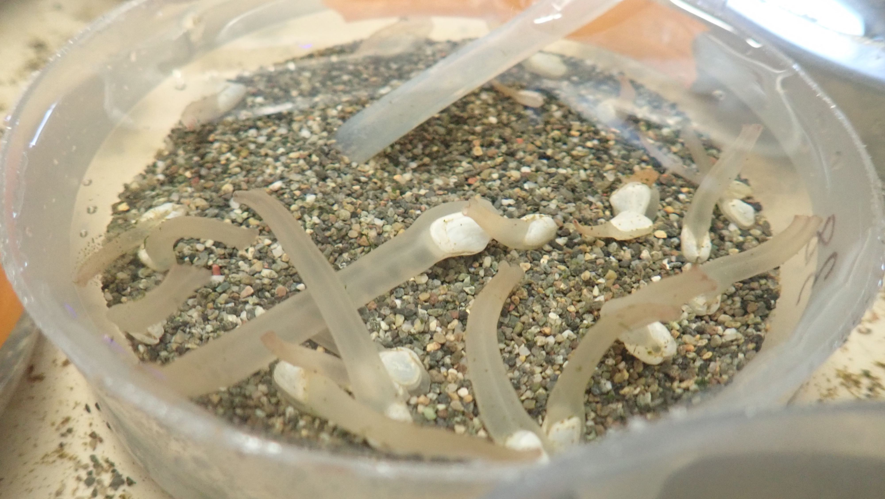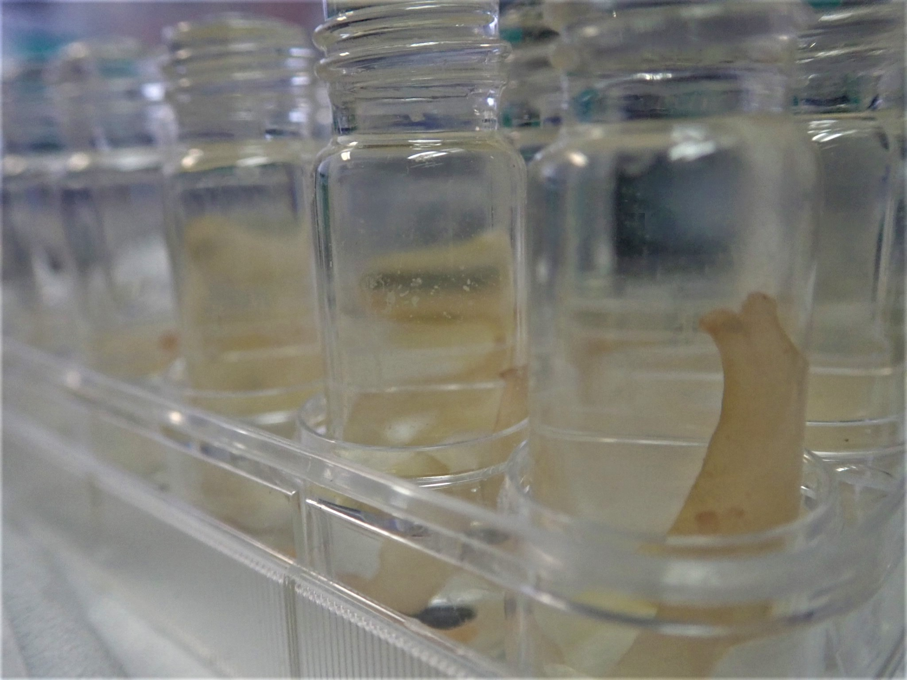

#### Treatments:

**'Priming' period:**
  - ambient pH / pCO2 = 7.9 pH / 900 µatm
  - moderate pH stress / elevated pCO2 = 7.4 pH / 3000 µatm

**Subsequent stress periods:**
- ambient pH / pCO2 = 7.9 pH / 900 µatm
- moderate pH stress / elevated pCO2 = 7.4 pH / 3000 µatm
- severe pH stress / elevated pCO2 = 7.1 pH / 4900 µatm

#### Results:

| stress conditioned? (Y/N) | repeat exposure (Y/N) | intensity (uatm) | respiration rate | shell growth | tissue growth (AFDW) | antioxidant capacity |
| --------: | --------: | --------:| --------: | --------: |  --------: | --------: |
| N  (ambient) | N | 900 µatm (ambient)  | - | - | ↓''   | ↑''|
| N (ambient)  | Y | 3000 and 4900 µatm (moderate & severe)  | ↓' |  ↓'' |  ↓'' | ↑''  |
| Y (moderate) | N | 900 µatm (ambient)  | ↓'' | -  | ↑'' | ↓''  |
| Y (moderate) | Y |3000 µatm (moderate) | ↑' | ↓'' | ↑'' | ↓''  |
| Y (moderate) | Y | 3000 and 4900 µatm (moderate and severe) | ↑'' |  ↑'' | ↑'' | ↓''  |

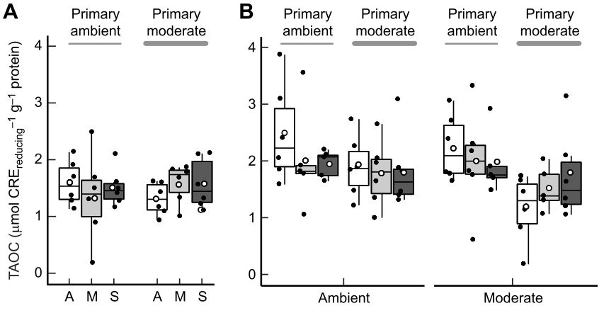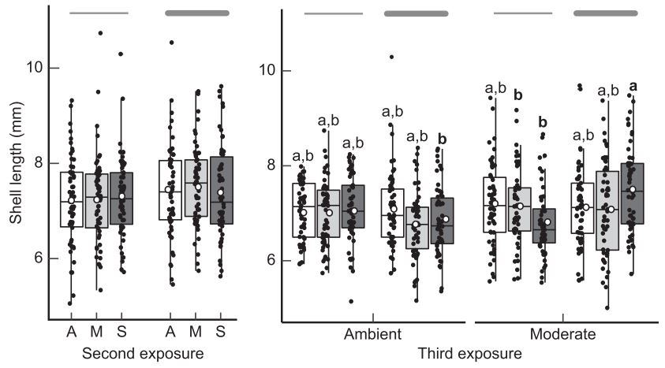

> *figure:* Total antioxidant capacity (top) and shell length (bottom) of juvenile pacific geoduck either naive ('primary ambient') or stress-primed (primary moderate) during pediveliger development and reexposed to a second stress period (A) and a third stress period (B) - from Gurr et al. 2021

#### Summary:

*Relative to naïve clams...*

**stress priming increased:**
-  respiration rate
- organic biomass
- shell size

**stress priming decreased:**
-  antioxidant capacity

..this suggests that stress over postlarval-to-juvenile development affects performance and oxidative status later in life. Moreover, priming practices tested in this study demonstrate stress intensity-specific responses and life-stages conducive to benefits later in life!

###  c) Gene expression of naive *v* stress-primed clams:

> *Reference:*
Gurr, S. J., Trigg, S. A., Vadopalas, B., Roberts, S. B., & Putnam, H. M. (in prep). Environmental conditioning of clams to low pH enhances robustness to environmental stress through acclimatory gene expression.

In the above experiment (*review #2 'Stress conditioning on subsequent response'*) we sequenced whole tissue samples of geoduck clams reared under ambient conditions (naive) and reared under the low-pH stress conditions (stress-primed).

*Our idea was....*

If we see these changes in their physical and subcellular traits (shell size, metabolic rates, antioxidant proteins, etc), are there also differences at the *molecular* level?

Does gene expression data give us a better picture of the *mechanisms of stress priming*?

#### Results:

> *figure:* summary of the gene expression data in our study presented as a Venn diagram for the experimental design. Subsets of the venn diagram demonstrate groups of processes to describe gene expression patterns from the naive and stress-primed ('acclimated') clams as white and grey clams, respectively. On the bottom of the figure are gene pathways expressed by the naive (white clam) and stress-primed/acclimated (grey clam) animals during the subsequent exposure periods.

#### Summary:

- Collectively, gene expression data in this study corroborates the physiological traits (*review #2 'Stress conditioning on subsequent response'*) and demonstrates both frontloaded and fine-tuned gene expression in th

**stress-primed animals:**
- under low pH: increased expression in immune response, mitochondrial and cellular quality control
- under ambient conditions: increased expression in energy metabolism and biosynthesis

**naïve animals:**
- under *all* conditions: increased expression for fatty acid metabolism and degradation of fatty acids, increase in antioxidants (glutathione)

- Our data suggests post-larval acclimatory periods to low pH can, via gene expression regulation, enhance robustness to environmental stress in juvenile Pacific geoducks.
Such stress priming approaches may be beneficial for aquaculture husbandry practices, as global seafood demand intensifies concurrent with increasing climate change in marine systems.

## **III.3 Takeaways for Aquaculture**

‘Stress priming’ to improve hatchery-propagated seed:

 Aquaculture is projected to surpass wild capture to satisfy global seafood demand (FAO 2020); therefore the irreversible nature of global acidification and rapid changes in coastal and benthic zones  require mitigation through societal actions (e.g. management interventions, policies and public awareness; Kelly et al., 2011) and aquaculture adaptations to improve food security.

Mild stress-priming may help to minimize effects of domestication selection ('unprepared' juvenile clams rearing under optimal conditions) and enhance resilience in hatchery-propagated seed. Gene expression patterns and physiological responses, as showcased in our tests, can expand resources for ecosystem conservation and aquaculture by optimizing the timing and stress type/intensity to elicit beneficial responses and identifying genes or gene-expression patterns associated with stress-resilient or fast-growing economic traits!

# **Acknowledgements**

Jamestown S'Klallam Tribe & all the managers and supporting staff/technicians at the Jamestown Point Whitney Shellfish Hatchery (Brinnonn, WA).

< insert picture of Kurt and the Jamestown personnel here>

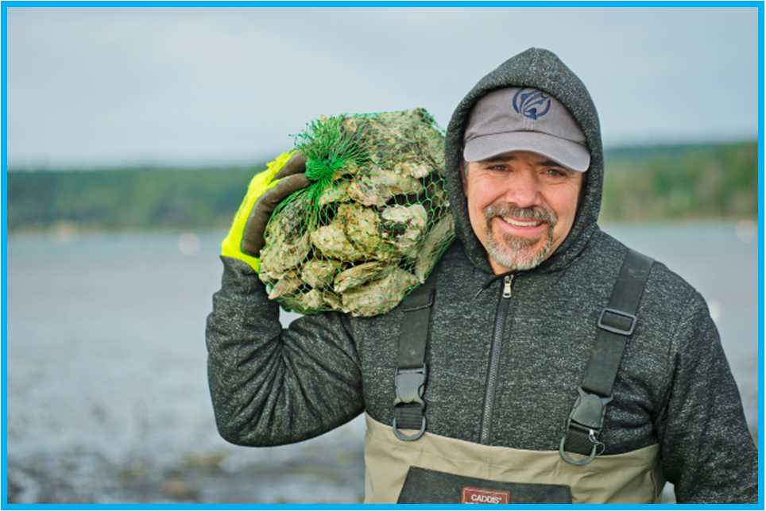

>  *photo/image (above):* Kurt Grinnell - CEO of Jamestown Seafood, Jamestown S’Klallam Tribal Council member (photo courtesy of Northwest Aquaculture Alliance /Jamestown S’Klallam Tribe)

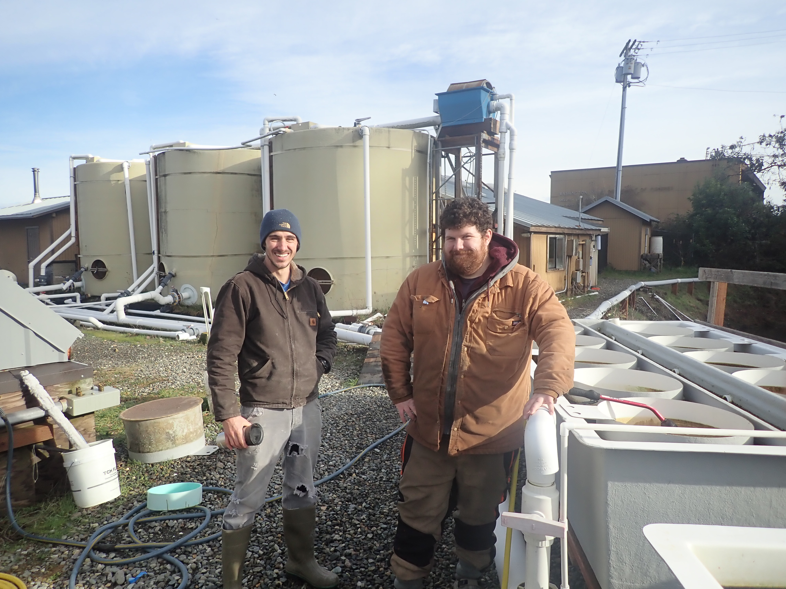

>  *photo/image (above):* Mat Henderson (left) and Josh Valley (right) at the Jamestown shellfish hatchery

### Funding sources
We thank our funding source the **Foundation for Food and Agriculture Research (FFAR)**; Grant ID: 554012, Development of Environmental Conditioning Practices to Decrease Impacts of Climate Change on Shellfish Aquaculture.
